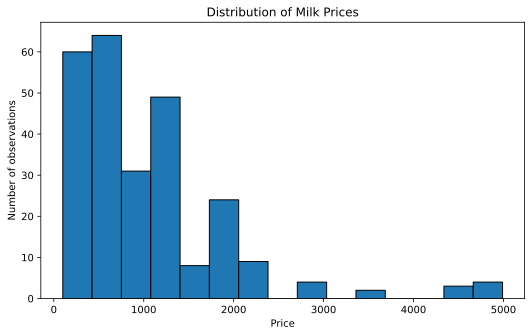
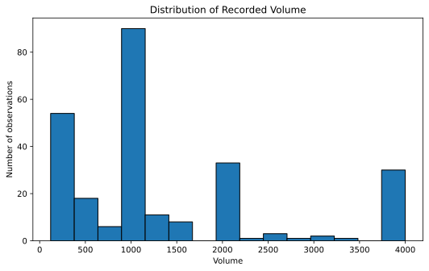
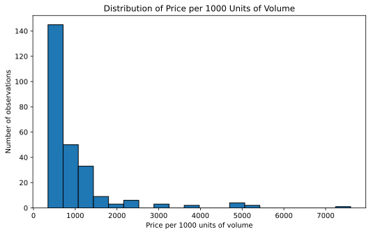
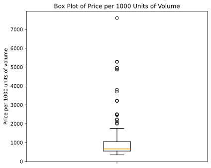
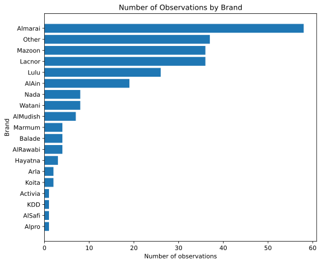
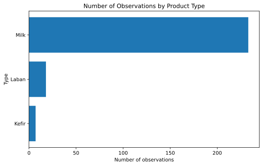
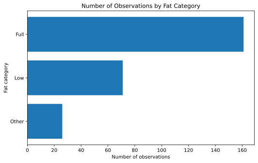
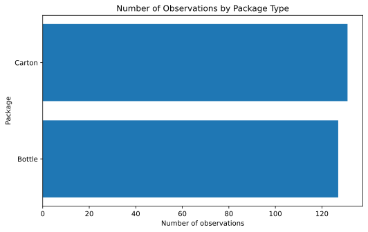

## Opening purpose

This chapter updates the univariate graphs using the actual course milk dataset:

```text
Milk_Data_S2025n.csv
```

A univariate graph studies one variable at a time. It helps us understand the distribution of a numeric variable or the frequency of categories in a categorical variable.

This chapter uses only observed information from the attached dataset. The dataset has **258 observations** and **12 columns**.

::: {.callout-tip}
For reusable plotting code, see [Appendix B. Python Code Guide](../appendices/appendix-b-python-code-guide.qmd).
:::

## Applied question

What does each main variable in the milk dataset look like when examined separately?

## Key idea

A univariate graph answers a basic question:

> What is the distribution of this variable?

For numeric variables, we can use:

- histogram
- density plot
- box plot

For categorical variables, we can use:

- frequency table
- bar chart

A univariate graph is descriptive. It does not explain why the pattern exists.

## Loading the dataset in Google Colab

The examples below assume that the dataset is saved in Google Drive as:

```text
MyDrive/NREC4107/data/Milk_Data_S2025n.csv
```

Students should change the file path if they saved the dataset somewhere else.

```python
from google.colab import drive
drive.mount('/content/drive')

import pandas as pd
import numpy as np
import matplotlib.pyplot as plt

data_path = "/content/drive/MyDrive/NREC4107/data/Milk_Data_S2025n.csv"
milk_data = pd.read_csv(data_path)

milk_data.head()
```

## Numeric variables in the dataset

The main numeric variables are:

```python
numeric_vars = ["Price", "Size", "Pieces", "Volume"]

milk_data[numeric_vars].describe()
```

The dataset also allows us to construct a unit-price style variable:

```python
milk_data["Price_per_1000_volume"] = (milk_data["Price"] / milk_data["Volume"]) * 1000

milk_data[["Price", "Volume", "Price_per_1000_volume"]].head()
```

This variable is called `Price_per_1000_volume` to avoid assuming a physical unit beyond the dataset. If the class confirms that `Volume` is measured in milliliters, it can be interpreted as price per liter.

## Price distribution

The observed `Price` variable ranges from **100.00** to **4,990.00**. The mean price is **1,028.08**, and the median price is **850.00**.

```python
plt.figure(figsize=(8, 5))
plt.hist(milk_data["Price"], bins=15, edgecolor="black")
plt.title("Distribution of Milk Prices")
plt.xlabel("Price")
plt.ylabel("Number of observations")
plt.show()
```



The histogram shows that many observations are concentrated at lower and middle price levels, while some observations have much higher prices. The mean is above the median, which is consistent with a right-skewed price distribution.

This is a visual description only. It does not explain why some products have higher prices.

## Volume distribution

The observed `Volume` variable ranges from **120.00** to **4,000.00**. The mean volume is **1,343.21**, and the median volume is **1,000.00**.

```python
plt.figure(figsize=(8, 5))
plt.hist(milk_data["Volume"], bins=15, edgecolor="black")
plt.title("Distribution of Recorded Volume")
plt.xlabel("Volume")
plt.ylabel("Number of observations")
plt.show()
```



The distribution shows that recorded volumes are not evenly spread across all possible values. Several common package volumes appear repeatedly.

This matters because total price is partly related to package volume. Later chapters will compare total price and unit price more carefully.

## Price per 1000 units of volume

The observed `Price_per_1000_volume` variable ranges from **347.50** to **7,600.00**. Its mean is **977.94**, and its median is **666.67**.

```python
plt.figure(figsize=(8, 5))
plt.hist(milk_data["Price_per_1000_volume"], bins=20, edgecolor="black")
plt.title("Distribution of Price per 1000 Units of Volume")
plt.xlabel("Price per 1000 units of volume")
plt.ylabel("Number of observations")
plt.show()
```



This graph is useful because total price can be difficult to compare when products have different volumes.

The unit-price style variable has a wider upper tail than total price. This suggests that some small-volume or premium products may have high prices relative to their recorded volume. This should be inspected carefully before making any economic conclusion.

## Box plot for price per 1000 units of volume

A box plot summarizes the median, quartiles, and values flagged by the interquartile range rule.

```python
plt.figure(figsize=(6, 5))
plt.boxplot(milk_data["Price_per_1000_volume"], vert=True)
plt.title("Box Plot of Price per 1000 Units of Volume")
plt.ylabel("Price per 1000 units of volume")
plt.xticks([1], [""])
plt.show()
```



Using the IQR rule, `Price` has **13** flagged values, while `Price_per_1000_volume` has **21** flagged values.

Flagged values are not automatically errors. They should be inspected in relation to brand, package type, flavor, and volume.

## Categorical variables in the dataset

The main categorical variables are:

```python
categorical_vars = ["Location", "Type", "Brand", "Fat", "Fresh", "Package", "Flavor"]

for var in categorical_vars:
    print("\n", var)
    print(milk_data[var].value_counts())
```

Observed category counts are:

- `Location`: Oman: 130, UAE: 128
- `Type`: Milk: 233, Laban: 18, Kefir: 7
- `Fat`: Full: 161, Low: 71, Other: 26
- `Fresh`: Yes: 142, No: 116
- `Package`: Carton: 131, Bottle: 127
- `Flavor`: No: 165, Yes: 93

## Brand frequency

The dataset includes **19** brand categories. The most common observed brands are:

```python
milk_data["Brand"].value_counts()
```



The six most frequent brand categories are: Almarai: 58, Other: 37, Mazoon: 36, Lacnor: 36, Lulu: 26, AlAin: 19.

These counts are frequencies in the dataset. They should not be interpreted as market shares unless the sampling design is known.

## Product type frequency

```python
milk_data["Type"].value_counts().plot(kind="barh")
plt.title("Number of Observations by Product Type")
plt.xlabel("Number of observations")
plt.ylabel("Type")
plt.show()
```



The dataset is dominated by `Milk` observations, with fewer `Laban` and `Kefir` observations.

This matters because conclusions about product types with fewer observations should be made cautiously.

## Fat category frequency

```python
milk_data["Fat"].value_counts().plot(kind="barh")
plt.title("Number of Observations by Fat Category")
plt.xlabel("Number of observations")
plt.ylabel("Fat category")
plt.show()
```



The most frequent fat category is `Full`, followed by `Low` and `Other`.

This pattern describes the dataset. It does not imply anything about consumer preferences or market shares without additional information about data collection.

## Package type frequency

```python
milk_data["Package"].value_counts().plot(kind="barh")
plt.title("Number of Observations by Package Type")
plt.xlabel("Number of observations")
plt.ylabel("Package")
plt.show()
```



The package variable is nearly balanced between `Carton` and `Bottle`: Carton: 131, Bottle: 127.

Package type is likely to be useful in later bivariate graphs and regression models.

## Why pie charts are not preferred here

Pie charts are sometimes used for categorical variables, but they are not ideal for this dataset.

For example, `Brand` has **19** categories. A pie chart with this many slices would be difficult to read. A bar chart is clearer because it allows direct comparison across categories.

For binary variables such as `Package`, `Fresh`, or `Flavor`, a pie chart may be readable, but a bar chart is still easier to compare and reproduce in a report.

## Interpretation

The univariate graphs show several important features of the attached dataset:

- `Price` is concentrated in lower and middle values, with some high-price observations.
- `Volume` has several repeated package-volume values.
- `Price_per_1000_volume` has a strong upper tail.
- `Brand` has many categories, but a small number of categories appear more frequently.
- `Type` is dominated by `Milk`.
- `Package` is almost evenly split between `Carton` and `Bottle`.
- `Fat`, `Fresh`, and `Flavor` are useful categorical variables for later analysis.

These are descriptive patterns. They prepare us for bivariate graphs, but they do not establish causal relationships.

## Common mistakes

- Treating a univariate graph as evidence of causality.
- Ignoring units when interpreting numeric variables.
- Comparing total price without considering volume.
- Using pie charts when categories are numerous.
- Deleting values only because they appear in the tail of a distribution.
- Interpreting dataset frequencies as market shares without knowing the sampling design.

## Key takeaway

- Univariate graphs describe one variable at a time.
- The attached dataset contains both numeric and categorical variables.
- Histograms are useful for `Price`, `Volume`, and `Price_per_1000_volume`.
- Bar charts are useful for `Brand`, `Type`, `Fat`, `Package`, `Fresh`, `Flavor`, and `Location`.
- Univariate graphs help us understand the data before comparing variables or estimating models.
