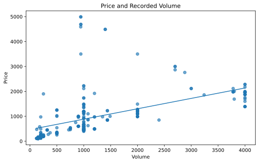
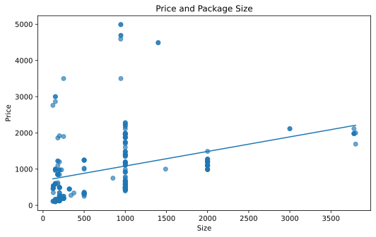
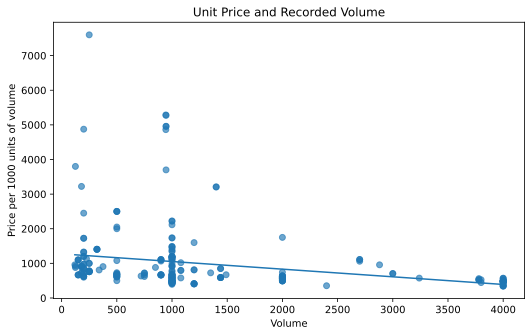
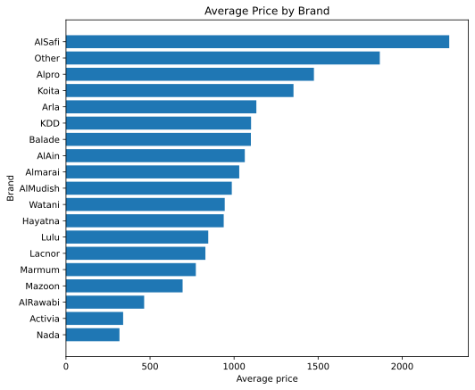
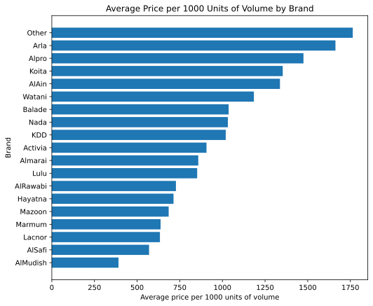
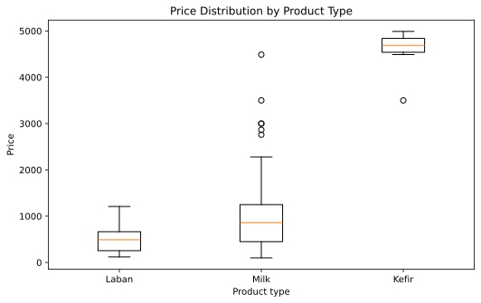
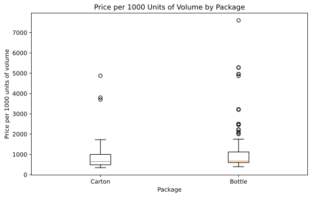
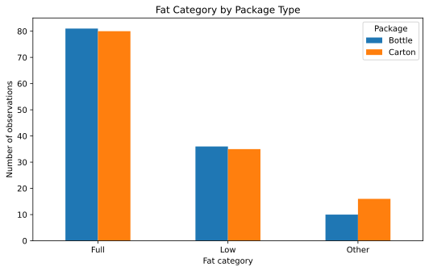

## Opening purpose

This chapter updates the bivariate graphs using the actual course milk dataset:

```text
Milk_Data_S2025n.csv
```

A bivariate graph studies two variables together. It helps us see whether two variables appear to be associated.

This chapter uses only observed information from the attached dataset. The dataset has **258 observations** and **12 columns**.

::: {.callout-tip}
For reusable plotting code, see [Appendix B. Python Code Guide](../appendices/appendix-b-python-code-guide.qmd).
:::

## Applied question

How are pairs of variables in the milk dataset related?

## Key idea

A bivariate graph answers this question:

> How does one variable differ when another variable changes?

The appropriate graph depends on the type of variables:

| Variable combination | Useful graph |
|---|---|
| Numeric and numeric | Scatter plot |
| Categorical and numeric | Box plot or grouped mean bar chart |
| Categorical and categorical | Grouped bar chart or cross-tabulation |

Bivariate graphs are descriptive. They can suggest associations, but they do not prove causality.

## Loading the dataset in Google Colab

The examples below assume that the dataset is saved in Google Drive as:

```text
MyDrive/NREC4107/data/Milk_Data_S2025n.csv
```

Students should change the file path if they saved the dataset somewhere else.

```python
from google.colab import drive
drive.mount('/content/drive')

import pandas as pd
import numpy as np
import matplotlib.pyplot as plt

data_path = "/content/drive/MyDrive/NREC4107/data/Milk_Data_S2025n.csv"
milk_data = pd.read_csv(data_path)

milk_data["Price_per_1000_volume"] = (milk_data["Price"] / milk_data["Volume"]) * 1000

milk_data.head()
```

## Numeric and numeric relationships

The first bivariate question is whether total price is associated with recorded volume.

```python
plt.figure(figsize=(8, 5))
plt.scatter(milk_data["Volume"], milk_data["Price"], alpha=0.65)

slope, intercept = np.polyfit(milk_data["Volume"], milk_data["Price"], 1)
x_values = np.linspace(milk_data["Volume"].min(), milk_data["Volume"].max(), 100)
plt.plot(x_values, intercept + slope * x_values)

plt.title("Price and Recorded Volume")
plt.xlabel("Volume")
plt.ylabel("Price")
plt.show()
```



The observed correlation between `Price` and `Volume` is **0.523**. This shows a positive association in the dataset.

This is expected descriptively: larger recorded volume tends to be associated with higher total price. However, this does not prove that changing package volume causes price to change. Brand, product type, package type, and flavor may also matter.

## Price and package size

The dataset also includes `Size`. The observed correlation between `Price` and `Size` is **0.339**.

```python
plt.figure(figsize=(8, 5))
plt.scatter(milk_data["Size"], milk_data["Price"], alpha=0.65)

slope, intercept = np.polyfit(milk_data["Size"], milk_data["Price"], 1)
x_values = np.linspace(milk_data["Size"].min(), milk_data["Size"].max(), 100)
plt.plot(x_values, intercept + slope * x_values)

plt.title("Price and Package Size")
plt.xlabel("Size")
plt.ylabel("Price")
plt.show()
```



The relationship between `Price` and `Size` is positive in the attached dataset. This is an association between two observed variables.

## Unit price and volume

Total price and unit-price style measures answer different questions.

Total price asks:

> Do larger products cost more in total?

Price per 1000 units of volume asks:

> Are larger products more or less expensive per recorded volume unit?

```python
plt.figure(figsize=(8, 5))
plt.scatter(milk_data["Volume"], milk_data["Price_per_1000_volume"], alpha=0.65)

slope, intercept = np.polyfit(milk_data["Volume"], milk_data["Price_per_1000_volume"], 1)
x_values = np.linspace(milk_data["Volume"].min(), milk_data["Volume"].max(), 100)
plt.plot(x_values, intercept + slope * x_values)

plt.title("Unit Price and Recorded Volume")
plt.xlabel("Volume")
plt.ylabel("Price per 1000 units of volume")
plt.show()
```



The observed correlation between `Price_per_1000_volume` and `Volume` is **-0.270**. This is a negative association in the dataset.

This suggests that larger recorded volumes tend to have lower price per 1000 units of volume. This is still descriptive and should not be treated as causal evidence.

## Comparing brands by average total price

A categorical and numeric relationship can be summarized using grouped means.

```python
avg_price_by_brand = (
    milk_data
    .groupby("Brand", observed=True)["Price"]
    .mean()
    .sort_values()
)

plt.figure(figsize=(8, 6))
plt.barh(avg_price_by_brand.index, avg_price_by_brand.values)
plt.title("Average Price by Brand")
plt.xlabel("Average price")
plt.ylabel("Brand")
plt.show()
```



The highest average total price is observed for `AlSafi` at **2,280.00**. The lowest average total price is observed for `Nada` at **318.12**.

These are averages in the dataset. They do not control for product volume, product type, package type, or other characteristics.

## Comparing brands by average unit price

Since total price depends strongly on volume, it is also useful to compare brands by price per 1000 units of volume.

```python
avg_unit_price_by_brand = (
    milk_data
    .groupby("Brand", observed=True)["Price_per_1000_volume"]
    .mean()
    .sort_values()
)

plt.figure(figsize=(8, 6))
plt.barh(avg_unit_price_by_brand.index, avg_unit_price_by_brand.values)
plt.title("Average Price per 1000 Units of Volume by Brand")
plt.xlabel("Average price per 1000 units of volume")
plt.ylabel("Brand")
plt.show()
```



The highest average unit-price style value is observed for `Other` at **1,764.03**. The lowest average unit-price style value is observed for `AlMudish` at **390.71**.

This comparison is usually more informative than comparing total price alone, but it still does not control for all product characteristics.

## Product type and price

A box plot shows how a numeric variable is distributed across categories.

```python
type_order = (
    milk_data
    .groupby("Type", observed=True)["Price"]
    .median()
    .sort_values()
    .index
)

data_by_type = [
    milk_data.loc[milk_data["Type"] == product_type, "Price"]
    for product_type in type_order
]

plt.figure(figsize=(8, 5))
plt.boxplot(data_by_type, tick_labels=type_order)
plt.title("Price Distribution by Product Type")
plt.xlabel("Product type")
plt.ylabel("Price")
plt.show()
```



Observed summary by product type:

| Type   |   count | mean     | median   |
|:-------|--------:|:---------|:---------|
| Kefir  |       7 | 4,562.86 | 4,690.00 |
| Milk   |     233 | 962.53   | 860.00   |
| Laban  |      18 | 501.94   | 490.00   |

The observed mean total price differs across product types. These differences may reflect volume, brand, product type, or other product characteristics. A graph alone cannot separate these effects.

## Package type and unit price

Package type is a categorical variable. Here we compare it with price per 1000 units of volume.

```python
package_order = (
    milk_data
    .groupby("Package", observed=True)["Price_per_1000_volume"]
    .median()
    .sort_values()
    .index
)

data_by_package = [
    milk_data.loc[milk_data["Package"] == package, "Price_per_1000_volume"]
    for package in package_order
]

plt.figure(figsize=(8, 5))
plt.boxplot(data_by_package, tick_labels=package_order)
plt.title("Price per 1000 Units of Volume by Package")
plt.xlabel("Package")
plt.ylabel("Price per 1000 units of volume")
plt.show()
```



Observed summary by package type:

| Package   |   count | mean     |   median |
|:----------|--------:|:---------|---------:|
| Bottle    |     127 | 1,145.23 |      670 |
| Carton    |     131 | 815.75   |      650 |

The observed unit-price style measure differs by package type. This may be related to product positioning, size differences, brand mix, or other characteristics.

## Fat category and price

Fat category is another categorical variable that may be related to price.

```python
milk_data.groupby("Fat", observed=True)["Price"].agg(["count", "mean", "median"])
```

Observed summary by fat category:

| Fat   |   count | mean     | median   |
|:------|--------:|:---------|:---------|
| Other |      26 | 1,729.27 | 1,155.00 |
| Low   |      71 | 981.00   | 665.00   |
| Full  |     161 | 935.61   | 850.00   |

These differences describe the dataset. They do not prove that fat category itself causes a price difference.

## Categorical and categorical relationship

The relationship between two categorical variables can be examined with a cross-tabulation.

```python
pd.crosstab(milk_data["Fat"], milk_data["Package"])
```

```python
fat_package_counts = pd.crosstab(milk_data["Fat"], milk_data["Package"])

fat_package_counts.plot(kind="bar", figsize=(8, 5))
plt.title("Fat Category by Package Type")
plt.xlabel("Fat category")
plt.ylabel("Number of observations")
plt.xticks(rotation=0)
plt.legend(title="Package")
plt.show()
```



This graph shows how observations are distributed across fat category and package type.

It is useful for understanding product composition before estimating models with categorical variables.

## Interpretation

The bivariate graphs show several observed patterns in the attached dataset:

- `Price` and `Volume` are positively associated.
- `Price` and `Size` are positively associated.
- `Price_per_1000_volume` and `Volume` are negatively associated.
- Brand rankings differ depending on whether we use total price or unit-price style measures.
- Product type, package type, and fat category show visible differences in price-related measures.
- Cross-tabulations help us see how categorical product characteristics are distributed together.

These patterns prepare us for regression analysis. They do not establish causal effects.

## Common mistakes

- Saying that volume causes price to change based only on a scatter plot.
- Comparing brands using total price without considering volume.
- Treating grouped averages as controlled regression results.
- Ignoring the number of observations in each category.
- Forgetting that categorical differences may reflect other variables.
- Interpreting correlation as causation.

## Key takeaway

- Bivariate graphs show relationships between two variables.
- Scatter plots are useful for numeric and numeric relationships.
- Box plots and grouped means are useful for categorical and numeric relationships.
- Cross-tabulations are useful for two categorical variables.
- Bivariate graphs suggest possible relationships, but they do not prove causality.
