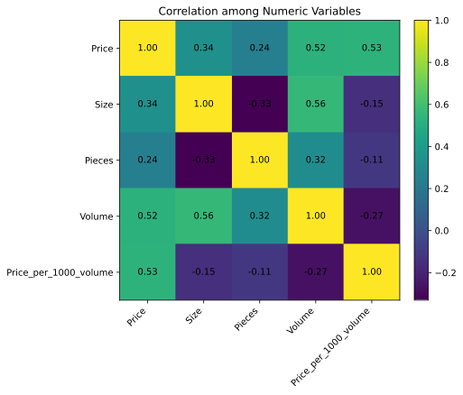
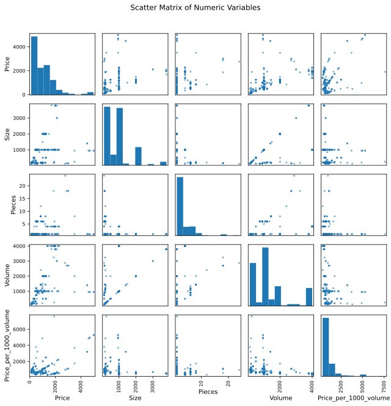
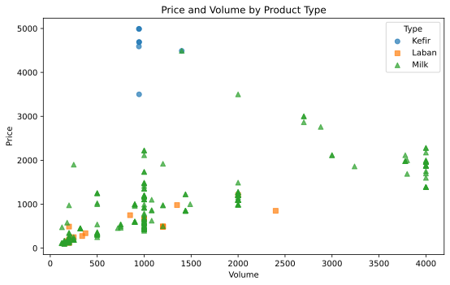
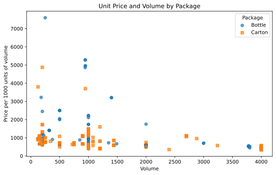
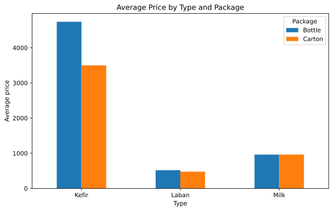
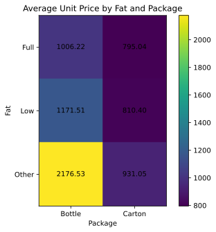
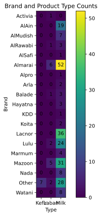
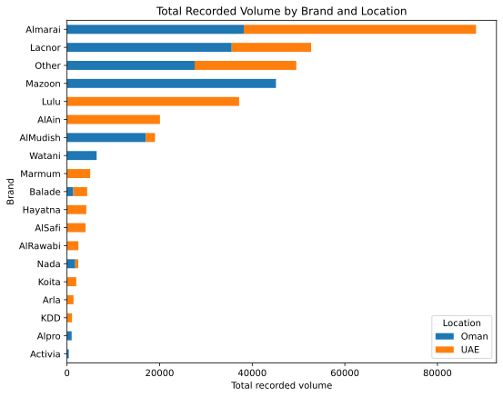

## Opening purpose

This chapter updates the multivariate and interactive graph examples using the actual course milk dataset:

```text
Milk_Data_S2025n.csv
```

A multivariate graph shows three or more variables together. It can reveal patterns that are not visible in one-variable or two-variable graphs.

This chapter uses only observed information from the attached dataset. The dataset has **258 observations** and **12 columns**.

## Applied question

How can we visualize several product characteristics in the milk dataset at the same time?

## Key idea

A multivariate graph answers this question:

> How do several variables appear to be related together?

Examples in this chapter include:

- price, volume, and product type
- unit price, volume, and package type
- product type, package type, and price
- fat category, package type, and unit price
- brand, product type, location, and recorded volume

These graphs are exploratory. They help us think about model design, but they do not replace regression analysis.

## Loading the dataset in Google Colab

The examples below assume that the dataset is saved in Google Drive as:

```text
MyDrive/NREC4107/data/Milk_Data_S2025n.csv
```

Students should change the file path if they saved the dataset somewhere else.

```python
from google.colab import drive
drive.mount('/content/drive')

import pandas as pd
import numpy as np
import matplotlib.pyplot as plt

data_path = "/content/drive/MyDrive/NREC4107/data/Milk_Data_S2025n.csv"
milk_data = pd.read_csv(data_path)

milk_data["Price_per_1000_volume"] = (milk_data["Price"] / milk_data["Volume"]) * 1000

milk_data.head()
```

For interactive graphs in Google Colab, we also use Plotly.

```python
import plotly.express as px
```

## Correlation heatmap

A correlation heatmap summarizes pairwise linear associations among several numeric variables.

```python
numeric_vars = ["Price", "Size", "Pieces", "Volume", "Price_per_1000_volume"]

corr_matrix = milk_data[numeric_vars].corr()

plt.figure(figsize=(8, 6))
plt.imshow(corr_matrix)
plt.colorbar()
plt.xticks(range(len(numeric_vars)), numeric_vars, rotation=45, ha="right")
plt.yticks(range(len(numeric_vars)), numeric_vars)

for i in range(len(numeric_vars)):
    for j in range(len(numeric_vars)):
        plt.text(j, i, f"{corr_matrix.iloc[i, j]:.2f}", ha="center", va="center")

plt.title("Correlation among Numeric Variables")
plt.show()
```



For the attached dataset:

- correlation between `Price` and `Volume`: **0.523**
- correlation between `Price` and `Size`: **0.339**
- correlation between `Price` and `Pieces`: **0.244**
- correlation between `Volume` and `Price_per_1000_volume`: **-0.270**
- correlation between `Size` and `Volume`: **0.557**

These are linear associations. They do not prove causality.

## Scatter matrix

A scatter matrix shows several pairwise numeric relationships at once.

```python
from pandas.plotting import scatter_matrix

numeric_vars = ["Price", "Size", "Pieces", "Volume", "Price_per_1000_volume"]

scatter_matrix(
    milk_data[numeric_vars],
    figsize=(9, 9),
    diagonal="hist",
    alpha=0.6
)

plt.suptitle("Scatter Matrix of Numeric Variables", y=1.02)
plt.show()
```



This graph is useful for scanning several relationships quickly.

However, a scatter matrix can become crowded. It should be used for exploration, not as the main figure in a short empirical report.

## Price, volume, and product type

A scatter plot can include a third variable by using marker groups.

```python
markers = ["o", "s", "^"]

plt.figure(figsize=(8, 5))

for index, (product_type, group_data) in enumerate(milk_data.groupby("Type", observed=True)):
    plt.scatter(
        group_data["Volume"],
        group_data["Price"],
        alpha=0.7,
        marker=markers[index % len(markers)],
        label=product_type
    )

plt.title("Price and Volume by Product Type")
plt.xlabel("Volume")
plt.ylabel("Price")
plt.legend(title="Type")
plt.show()
```



The graph shows the relationship between total price and recorded volume while distinguishing product types.

It suggests that volume and price should not be studied without considering product type. However, the graph alone does not estimate a controlled effect.

## Unit price, volume, and package type

```python
markers = ["o", "s"]

plt.figure(figsize=(8, 5))

for index, (package, group_data) in enumerate(milk_data.groupby("Package", observed=True)):
    plt.scatter(
        group_data["Volume"],
        group_data["Price_per_1000_volume"],
        alpha=0.7,
        marker=markers[index % len(markers)],
        label=package
    )

plt.title("Unit Price and Volume by Package")
plt.xlabel("Volume")
plt.ylabel("Price per 1000 units of volume")
plt.legend(title="Package")
plt.show()
```



This graph combines three variables: recorded volume, price per 1000 units of volume, and package type.

It helps us see whether the negative association between volume and unit price differs visually across package types.

## Product type, package type, and average price

Grouped bar charts can compare a numeric variable across two categorical variables.

```python
avg_price_type_package = (
    milk_data
    .groupby(["Type", "Package"], observed=True)["Price"]
    .mean()
    .unstack()
)

avg_price_type_package.plot(kind="bar", figsize=(8, 5))
plt.title("Average Price by Type and Package")
plt.xlabel("Type")
plt.ylabel("Average price")
plt.xticks(rotation=0)
plt.legend(title="Package")
plt.show()
```



Observed average prices by product type and package are:

| Type   | Bottle   | Carton   |
|:-------|:---------|:---------|
| Kefir  | 4,740.00 | 3,500.00 |
| Laban  | 518.18   | 476.43   |
| Milk   | 961.28   | 963.65   |

The highest observed average total price is for `Kefir` with `Bottle` package, at **4,740.00**. The lowest observed average total price is for `Laban` with `Carton` package, at **476.43**.

These are grouped averages, not controlled estimates.

## Fat category, package type, and unit price

We can also summarize average price per 1000 units of volume by fat category and package type.

```python
avg_unit_fat_package = (
    milk_data
    .groupby(["Fat", "Package"], observed=True)["Price_per_1000_volume"]
    .mean()
    .unstack()
)

plt.figure(figsize=(8, 5))
plt.imshow(avg_unit_fat_package)
plt.colorbar()
plt.xticks(range(len(avg_unit_fat_package.columns)), avg_unit_fat_package.columns)
plt.yticks(range(len(avg_unit_fat_package.index)), avg_unit_fat_package.index)

for i in range(avg_unit_fat_package.shape[0]):
    for j in range(avg_unit_fat_package.shape[1]):
        value = avg_unit_fat_package.iloc[i, j]
        if pd.notna(value):
            plt.text(j, i, f"{value:.2f}", ha="center", va="center")

plt.title("Average Unit Price by Fat and Package")
plt.xlabel("Package")
plt.ylabel("Fat")
plt.show()
```



Observed averages are:

| Fat   | Bottle   |   Carton |
|:------|:---------|---------:|
| Full  | 1,006.22 |   795.04 |
| Low   | 1,171.51 |   810.4  |
| Other | 2,176.53 |   931.05 |

The highest observed average value is for `Other` fat category with `Bottle` package, at **2,176.53**. The lowest observed average value is for `Full` fat category with `Carton` package, at **795.04**.

This pattern may guide later regression with categorical variables.

## Brand and product type counts

A cross-tabulation can summarize how two categorical variables are distributed together.

```python
brand_type_counts = pd.crosstab(milk_data["Brand"], milk_data["Type"])

brand_type_counts
```

```python
plt.figure(figsize=(8, 6))
plt.imshow(brand_type_counts)
plt.colorbar()
plt.xticks(range(len(brand_type_counts.columns)), brand_type_counts.columns)
plt.yticks(range(len(brand_type_counts.index)), brand_type_counts.index)

for i in range(brand_type_counts.shape[0]):
    for j in range(brand_type_counts.shape[1]):
        plt.text(j, i, str(brand_type_counts.iloc[i, j]), ha="center", va="center")

plt.title("Brand and Product Type Counts")
plt.xlabel("Type")
plt.ylabel("Brand")
plt.show()
```



The brand with the highest number of observations is `Almarai`, with **58** observations.

These counts describe the attached dataset. They should not be interpreted as market shares unless the data collection design supports that interpretation.

## Brand, location, and total recorded volume

A stacked horizontal bar chart can show how recorded volume varies by brand and location.

```python
brand_location_volume = (
    milk_data
    .groupby(["Brand", "Location"], observed=True)["Volume"]
    .sum()
    .unstack()
    .fillna(0)
)

brand_location_volume["Total"] = brand_location_volume.sum(axis=1)
brand_location_volume = brand_location_volume.sort_values("Total").drop(columns="Total")

brand_location_volume.plot(kind="barh", stacked=True, figsize=(8, 6))
plt.title("Total Recorded Volume by Brand and Location")
plt.xlabel("Total recorded volume")
plt.ylabel("Brand")
plt.legend(title="Location")
plt.show()
```



The brand with the largest total recorded volume is `Almarai`, with total recorded volume of **88,325.00**.

Again, this is a feature of the dataset. It should not be treated as a population market-share estimate without knowing the sampling design.

## Interactive treemap in Google Colab

Interactive charts are useful for exploration. They are especially helpful when categories are nested.

```python
fig = px.treemap(
    milk_data,
    path=["Brand"],
    values="Volume",
    title="Brand Contribution to Total Recorded Volume"
)

fig.show()
```

This treemap helps students explore how recorded volume is distributed across brands.

It is an exploratory graph. It should not be treated as formal evidence by itself.

## Interactive sunburst chart

```python
fig = px.sunburst(
    milk_data,
    path=["Location", "Brand", "Package"],
    values="Volume",
    title="Location, Brand, and Package Structure"
)

fig.show()
```

The sunburst chart helps explore nested categorical structure. It is useful for classroom discussion, but a simpler static graph is usually better for a final empirical report.

## Interactive 3D scatter plot

```python
fig = px.scatter_3d(
    milk_data,
    x="Volume",
    y="Size",
    z="Price",
    color="Type",
    hover_data=["Brand", "Package", "Fat"],
    title="Volume, Size, and Price by Product Type"
)

fig.show()
```

A 3D graph can be visually engaging, but it is not always easier to interpret. It should be used only when it helps students see the data more clearly.

## Interpretation

The multivariate graphs show that several variables matter at the same time.

Observed patterns include:

- `Price` is positively associated with `Volume`.
- `Price_per_1000_volume` is negatively associated with `Volume`.
- Product type and package type help organize visible price differences.
- Fat category and package type show differences in average unit-price style values.
- Brand and product type are not evenly distributed across all categories.
- Brand, location, and recorded volume can be explored together.

These patterns motivate multiple regression, dummy variables, and interaction terms in later chapters.

## Common mistakes

- Adding too many variables to one graph.
- Treating interactive exploration as formal evidence.
- Interpreting grouped averages as causal effects.
- Forgetting that categories may have different numbers of observations.
- Treating dataset frequencies as market shares without sampling information.
- Using 3D graphs because they look impressive rather than because they clarify the pattern.

## Key takeaway

- Multivariate graphs show several variables together.
- Heatmaps and scatter matrices help summarize numeric relationships.
- Grouped charts help compare categorical combinations.
- Interactive charts are useful for exploration in Google Colab.
- More complex graphs require more careful interpretation.
