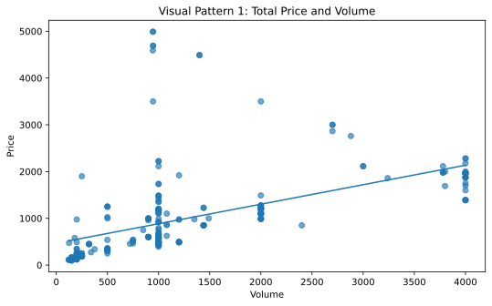
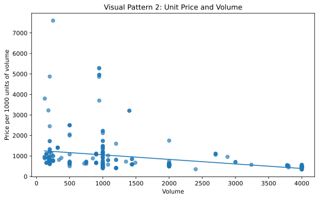
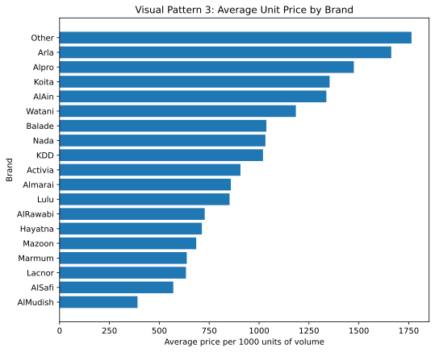
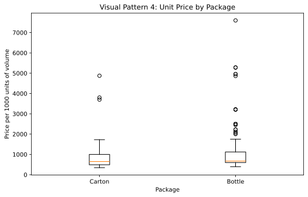
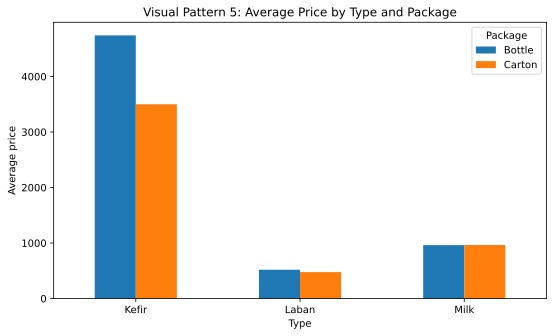

## Opening purpose

This chapter updates the transition from graphs to research questions using the actual course milk dataset:

```text
Milk_Data_S2025n.csv
```

The goal is to show how visual patterns can become clear empirical questions. A graph is not the final answer. It is a way to organize what we observe and decide what to investigate next.

This chapter uses only observed information from the attached dataset. The dataset has **258 observations** and **12 columns**.

## Applied question

How can we turn visual patterns in the milk dataset into applied econometric questions?

## Key idea

A graph can suggest a question, but it does not fully answer the question.

For example, a scatter plot may show that total price is positively associated with recorded volume. That visual pattern can become a research question:

> How is total price associated with recorded volume?

A different graph may show that price per 1000 units of volume is negatively associated with recorded volume. That becomes a different research question:

> Are larger-volume products associated with lower unit-price style values?

These two questions are related, but they are not the same.

## Loading the dataset in Google Colab

The examples below assume that the dataset is saved in Google Drive as:

```text
MyDrive/NREC4107/data/Milk_Data_S2025n.csv
```

Students should change the file path if they saved the dataset somewhere else.

```python
from google.colab import drive
drive.mount('/content/drive')

import pandas as pd
import numpy as np
import matplotlib.pyplot as plt

data_path = "/content/drive/MyDrive/NREC4107/data/Milk_Data_S2025n.csv"
milk_data = pd.read_csv(data_path)

milk_data["Price_per_1000_volume"] = (milk_data["Price"] / milk_data["Volume"]) * 1000

milk_data.head()
```

## A practical workflow

A useful workflow is:

1. Draw a graph.
2. Describe the visual pattern without exaggeration.
3. Decide which variable is the outcome.
4. Decide which variable may explain or predict the outcome.
5. State whether the question is descriptive, associational, predictive, or causal.
6. Choose a method that matches the question.

This chapter stays at the descriptive and associational stage. Causal interpretation requires stronger research design.

## Pattern 1: total price and recorded volume

```python
plt.figure(figsize=(8, 5))
plt.scatter(milk_data["Volume"], milk_data["Price"], alpha=0.65)

slope, intercept = np.polyfit(milk_data["Volume"], milk_data["Price"], 1)
x_values = np.linspace(milk_data["Volume"].min(), milk_data["Volume"].max(), 100)
plt.plot(x_values, intercept + slope * x_values)

plt.title("Visual Pattern 1: Total Price and Volume")
plt.xlabel("Volume")
plt.ylabel("Price")
plt.show()
```



Observed pattern:

> Products with larger recorded volume tend to have higher total prices.

The observed correlation between `Price` and `Volume` is **0.523**.

Possible research question:

> How is total price associated with recorded volume?

Possible dependent variable:

```text
Price
```

Possible explanatory variable:

```text
Volume
```

A later simple regression could be written as:

\[
Price_i = \beta_0 + \beta_1 Volume_i + u_i
\]

This is an association model. It should not be described as proving that volume causes price to change.

## Pattern 2: unit-price style value and recorded volume

Total price can be misleading when volumes differ. We therefore use `Price_per_1000_volume` as a unit-price style variable.

```python
plt.figure(figsize=(8, 5))
plt.scatter(milk_data["Volume"], milk_data["Price_per_1000_volume"], alpha=0.65)

slope, intercept = np.polyfit(milk_data["Volume"], milk_data["Price_per_1000_volume"], 1)
x_values = np.linspace(milk_data["Volume"].min(), milk_data["Volume"].max(), 100)
plt.plot(x_values, intercept + slope * x_values)

plt.title("Visual Pattern 2: Unit Price and Volume")
plt.xlabel("Volume")
plt.ylabel("Price per 1000 units of volume")
plt.show()
```



Observed pattern:

> Larger recorded volumes are associated with lower price per 1000 units of volume.

The observed correlation between `Price_per_1000_volume` and `Volume` is **-0.270**.

Possible research question:

> Are larger-volume products associated with lower unit-price style values?

Possible dependent variable:

```text
Price_per_1000_volume
```

Possible explanatory variable:

```text
Volume
```

This is a different question from asking whether larger products have higher total prices.

## Pattern 3: brand differences in unit-price style values

```python
avg_unit_price_by_brand = (
    milk_data
    .groupby("Brand", observed=True)["Price_per_1000_volume"]
    .mean()
    .sort_values()
)

plt.figure(figsize=(8, 6))
plt.barh(avg_unit_price_by_brand.index, avg_unit_price_by_brand.values)
plt.title("Visual Pattern 3: Average Unit Price by Brand")
plt.xlabel("Average price per 1000 units of volume")
plt.ylabel("Brand")
plt.show()
```



Observed pattern:

> Average unit-price style values differ across brands.

The highest observed average is for `Other`, at **1,764.03**. The lowest observed average is for `AlMudish`, at **390.71**.

Possible research question:

> Are brand differences in unit-price style values still visible after accounting for volume, product type, and package type?

Possible dependent variable:

```text
Price_per_1000_volume
```

Possible explanatory variables:

```text
Brand, Volume, Type, Package
```

This question prepares us for multiple regression and dummy variables.

## Pattern 4: package type and unit-price style values

```python
package_order = (
    milk_data
    .groupby("Package", observed=True)["Price_per_1000_volume"]
    .median()
    .sort_values()
    .index
)

data_by_package = [
    milk_data.loc[milk_data["Package"] == package, "Price_per_1000_volume"]
    for package in package_order
]

plt.figure(figsize=(8, 5))
plt.boxplot(data_by_package, tick_labels=package_order)
plt.title("Visual Pattern 4: Unit Price by Package")
plt.xlabel("Package")
plt.ylabel("Price per 1000 units of volume")
plt.show()
```



Observed summary by package type:

| Package   |   count | mean     |   median |
|:----------|--------:|:---------|---------:|
| Bottle    |     127 | 1,145.23 |      670 |
| Carton    |     131 | 815.75   |      650 |

Possible research question:

> Is package type associated with unit-price style differences?

Possible dependent variable:

```text
Price_per_1000_volume
```

Possible explanatory variable:

```text
Package
```

A later regression could include `Package` as a categorical variable. The interpretation must be cautious because package type may be related to brand, size, product type, and other characteristics.

## Pattern 5: product type, package type, and average price

```python
avg_price_type_package = (
    milk_data
    .groupby(["Type", "Package"], observed=True)["Price"]
    .mean()
    .unstack()
)

avg_price_type_package.plot(kind="bar", figsize=(8, 5))
plt.title("Visual Pattern 5: Average Price by Type and Package")
plt.xlabel("Type")
plt.ylabel("Average price")
plt.xticks(rotation=0)
plt.legend(title="Package")
plt.show()
```



Observed average prices are:

| Type   | Bottle   | Carton   |
|:-------|:---------|:---------|
| Kefir  | 4,740.00 | 3,500.00 |
| Laban  | 518.18   | 476.43   |
| Milk   | 961.28   | 963.65   |

Possible research question:

> Do product type and package type jointly help explain observed price differences?

Possible dependent variable:

```text
Price
```

Possible explanatory variables:

```text
Type, Package, Volume
```

This question moves beyond a two-variable comparison because it suggests that product characteristics may work together.

## Organizing visual observations

The table below converts the observed visual patterns into possible empirical questions.

| Observed visual pattern                                           | Possible dependent variable   | Main explanatory variable   | Question type                          |
|:------------------------------------------------------------------|:------------------------------|:----------------------------|:---------------------------------------|
| Total price rises with recorded volume                            | Price                         | Volume                      | Association                            |
| Price per 1000 units of volume falls as recorded volume increases | Price_per_1000_volume         | Volume                      | Association                            |
| Average unit-price style values differ across brands              | Price_per_1000_volume         | Brand                       | Association with categorical variables |
| Unit-price style values differ by package type                    | Price_per_1000_volume         | Package                     | Association with categorical variables |
| Average total price differs across type and package combinations  | Price                         | Type and Package            | Association with grouped categories    |

This table is not a model. It is a planning tool.

## Description, association, prediction, and causality

The same visual pattern can lead to different types of questions.

A descriptive statement is:

> The dataset includes products with different recorded volumes and prices.

An associational statement is:

> Price is positively associated with recorded volume.

A predictive question is:

> Can volume, brand, type, and package help predict price?

A causal claim would be stronger:

> Increasing volume causes price to change.

The graphs in this chapter support description and association. They do not establish causality.

## Choosing the dependent variable

A research question should clearly identify the dependent variable.

| Research question | Dependent variable |
|---|---|
| How is total price associated with volume? | `Price` |
| Are larger-volume products associated with lower unit-price style values? | `Price_per_1000_volume` |
| Do brands differ in unit-price style values? | `Price_per_1000_volume` |
| Is package type associated with unit-price style values? | `Price_per_1000_volume` |
| Do product type and package type help explain total price? | `Price` |

A weak empirical project starts with many variables but no clear outcome. A stronger project begins with the outcome variable.

## Choosing explanatory variables

Explanatory variables should be selected using economic reasoning and data knowledge.

For this dataset, possible explanatory variables include:

- `Volume`
- `Size`
- `Pieces`
- `Brand`
- `Type`
- `Fat`
- `Fresh`
- `Package`
- `Flavor`
- `Location`

Adding all variables without a reason may make interpretation harder. Omitting relevant variables may also make interpretation misleading.

## From graph to model

A visual relationship between total price and volume can lead to a simple regression:

\[
Price_i = \beta_0 + \beta_1 Volume_i + u_i
\]

A richer question can lead to a multiple regression:

\[
Price_i = \beta_0 + \beta_1 Volume_i + \beta_2 Type_i + \beta_3 Package_i + u_i
\]

The second model asks whether the volume-price relationship remains after accounting for product type and package type.

At this stage, the model is still associational unless the research design supports a causal interpretation.

## Interpretation

Graphs are useful because they help us ask better questions.

In the attached dataset, the graphs suggest several useful empirical directions:

- total price and recorded volume move together
- unit-price style values decline as recorded volume increases
- brand differences appear in unit-price style values
- package type is associated with unit-price style differences
- product type and package type may jointly help explain total price

These are starting points for regression analysis, not final conclusions.

## Common mistakes

- Starting with software instead of a question.
- Treating every visible difference as important.
- Confusing total price with unit-price style values.
- Claiming causality from a graph.
- Ignoring the dependent variable.
- Adding many explanatory variables without an economic reason.
- Treating dataset frequencies or grouped averages as population facts without sampling information.

## Key takeaway

- Graphs help transform data exploration into empirical questions.
- Each research question needs a clear dependent variable.
- Total price and unit-price style values answer different questions.
- Visual patterns suggest associations, not causal effects.
- Good visualization prepares students for better regression analysis.
