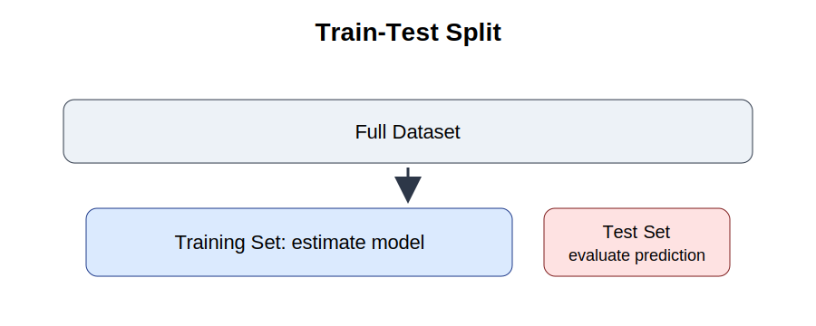



```{python}
#| echo: false
import pandas as pd

milk_data = pd.read_csv("Milk_Data_S2025n.csv")
```

# 22. Train Test Split

::: {.callout-tip}
For train-test split and prediction code templates, see [Appendix B. Python Code Guide](../appendices/appendix-b-python-code-guide.qmd).
:::

## Purpose

Regression models are often evaluated using the same data that were used to estimate them. This can create a false sense of confidence. A model may fit existing observations well but perform poorly when it faces new observations.

This chapter introduces the logic of prediction. The key idea is that a predictive model should be evaluated on data it has not seen before. This is the foundation of modern machine learning and practical forecasting.

## Applied question

Can we accurately predict milk prices for products that were not used to estimate the model?

## Key idea

A model should be evaluated on unseen observations.

If a model performs well on new data, it is more likely to be useful for prediction. If it only performs well on the data used to estimate it, the model may be overfitting.

::: {.callout-tip title="Core distinction"}
Econometrics often focuses on understanding relationships. Prediction focuses on forecasting unknown or future outcomes.
:::

## Minimal equation

The prediction error for observation \(i\) is:

\[
Error_i = Actual_i - Predicted_i
\]

where `Actual` is the observed value, `Predicted` is the model forecast, and `Error` measures prediction accuracy.

A good prediction model produces small prediction errors.

## 22.1 Why prediction requires new data

Suppose we estimate a regression model using all available observations and obtain a high \(R^2\). Does this mean the model predicts well?

Not necessarily.

A model can memorize patterns that are specific to the sample. When new observations arrive, prediction accuracy may fall sharply. This problem is called **overfitting**.

The goal of prediction is not to explain the past perfectly. The goal is to perform well on observations that were not used during estimation.

For this reason, predictive models should be tested using unseen data.

## 22.2 Train-test split

A train-test split divides the dataset into two parts.

| Dataset | Purpose |
|---|---|
| Training set | Estimate the model |
| Test set | Evaluate prediction accuracy |

A common choice is 80 percent for training and 20 percent for testing. The model learns from the training data and is evaluated on the test data.

{fig-alt="Train-test split diagram showing data divided into training data and test data." width="85%"}

## Python implementation

```{python}
import pandas as pd
from sklearn.model_selection import train_test_split

# Example predictors and outcome
X = milk_data[["Volume"]]
y = milk_data["Price"]

X_train, X_test, y_train, y_test = train_test_split(
    X,
    y,
    test_size=0.20,
    random_state=4107
)

print("Training observations:", len(X_train))
print("Testing observations:", len(X_test))
```

## Interpretation

The model uses only the training observations to estimate the relationship between volume and price. The test observations remain hidden until evaluation. This gives a more realistic assessment of predictive performance.

## 22.3 Fitting a prediction model

We begin with a simple linear prediction model:

\[
Price_i = \beta_0 + \beta_1 Volume_i + u_i
\]

The model is estimated using only the training sample.

```{python}
from sklearn.linear_model import LinearRegression

model = LinearRegression()
model.fit(X_train, y_train)

y_pred = model.predict(X_test)
```

## Interpretation

The model has not seen the observations in the test sample. Prediction performance therefore reflects the model's ability to generalize beyond the data used for estimation.

## 22.4 Measuring prediction accuracy

Prediction quality can be measured using several statistics.

### Mean absolute error

\[
MAE = \frac{1}{n}\sum |Actual_i - Predicted_i|
\]

MAE measures the average absolute prediction error.

### Mean squared error

\[
MSE = \frac{1}{n}\sum (Actual_i - Predicted_i)^2
\]

MSE penalizes large errors more heavily because errors are squared.

### Root mean squared error

\[
RMSE = \sqrt{MSE}
\]

RMSE is often easier to interpret because it is expressed in the same unit as the dependent variable.

```{python}
from sklearn.metrics import mean_absolute_error, mean_squared_error

mae = mean_absolute_error(y_test, y_pred)
mse = mean_squared_error(y_test, y_pred)
rmse = mse ** 0.5

print("MAE :", round(mae, 3))
print("MSE :", round(mse, 3))
print("RMSE:", round(rmse, 3))
```

## Interpretation

Suppose RMSE equals 0.25 OMR. This means the typical prediction error is approximately 0.25 OMR. Whether this is acceptable depends on the economic context and the variability of prices in the dataset.

## 22.5 Visualizing prediction performance

Numerical measures are useful, but graphs often reveal additional information. A simple approach is to compare actual and predicted values.

```{python}
import matplotlib.pyplot as plt

plt.figure(figsize=(7, 5))
plt.scatter(y_test, y_pred, alpha=0.7)
plt.xlabel("Actual Price")
plt.ylabel("Predicted Price")
plt.title("Actual versus Predicted Prices")
plt.show()
```

## Interpretation

If predictions are accurate, points should cluster close to a 45-degree line. Large deviations indicate weak predictive performance. Patterns in the errors may suggest missing variables or model misspecification.

## 22.6 Underfitting and overfitting

Prediction models can fail in two opposite ways.

**Underfitting** occurs when a model is too simple. It ignores important relationships and performs poorly on both training and testing data.

**Overfitting** occurs when a model is too complex. It performs very well on the training data but poorly on the test data because it learns noise rather than general patterns.

The goal is to balance simplicity, flexibility, and generalization.

::: {.callout-warning title="Common mistake"}
Do not evaluate a model only on the same observations used to estimate it. A model can appear strong in-sample while performing poorly on new data.
:::

## Key takeaway

- Prediction should be evaluated using unseen observations.
- A train-test split separates estimation from evaluation.
- MAE, MSE, and RMSE are common prediction metrics.
- Overfitting occurs when a model memorizes the training data.
- Strong explanatory power does not guarantee strong predictive performance.

## Looking ahead

In the next chapter, we compare traditional regression models with machine learning methods and discuss when prediction accuracy should take precedence over coefficient interpretation.

<div class="chapter-nav">
  <div class="prev"><a href="part-v-prediction-machine-learning.html">← Part V</a></div>
  <div class="next"><a href="chapter-23-regression-vs-machine-learning.html">Next: 23 →</a></div>
</div>
