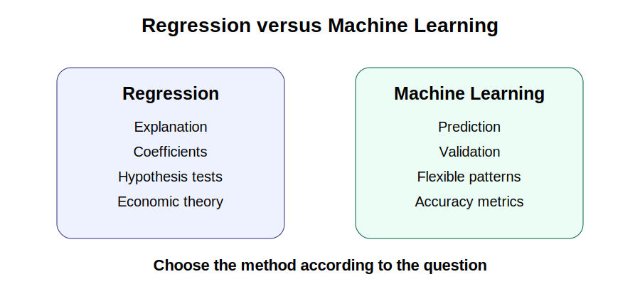



```{python}
#| echo: false
import pandas as pd
from sklearn.model_selection import train_test_split

milk_data = pd.read_csv("Milk_Data_S2025n.csv")

X_train, X_test, y_train, y_test = train_test_split(
    milk_data[["Volume"]],
    milk_data["Price"],
    test_size=0.20,
    random_state=4107
)
```

::: {.callout-tip}
For interpretation rules used in regression and prediction discussions, see [Appendix A. Formula Sheet](../appendices/appendix-a-formula-sheet.qmd).
:::

## Purpose

Regression models and machine learning models are often presented as competing approaches. In practice, they are designed to answer different questions.

Econometric models are commonly used to understand relationships, test hypotheses, and evaluate economic mechanisms. Machine learning models are usually designed to maximize predictive accuracy.

This chapter compares the two approaches and explains when each is appropriate.

## Applied question

If our goal is to understand milk prices, should we use regression or machine learning?

## Key idea

The best model depends on the objective. If the goal is explanation, interpretation, and policy analysis, regression is often preferred. If the goal is accurate prediction, machine learning may perform better.

Neither approach is universally superior.

{fig-alt="Diagram comparing regression for explanation and machine learning for prediction." width="85%"}

## Minimal comparison

| Objective | Regression | Machine learning |
|---|---:|---:|
| Explain relationships | Strong | Limited |
| Test hypotheses | Strong | Rare |
| Estimate causal effects | Possible with design | Difficult by default |
| Predict new observations | Good | Often stronger |
| Interpret coefficients | Strong | Often weak |
| Handle complex patterns | Limited | Strong |

## 23.1 Why economists use regression

Regression models are closely connected to economic theory. Suppose we estimate:

$$
Price_i = \beta_0 + \beta_1 Volume_i + u_i
$$

The coefficient \(\beta_1\) has a direct interpretation. For example, a one-liter increase in package volume may be associated with a specific change in price, on average.

Regression allows researchers to estimate economic relationships, test hypotheses, construct confidence intervals, and communicate findings clearly.

```{python}
import statsmodels.api as sm

X = milk_data[["Volume"]]
y = milk_data["Price"]

X = sm.add_constant(X)
model = sm.OLS(y, X).fit()

print(model.summary())
```

## Interpretation

The primary output of interest is usually the coefficient estimate. Researchers ask whether the coefficient is positive or negative, statistically significant, and economically meaningful.

Prediction may be useful, but explanation is usually the main objective.

## 23.2 Why data scientists use machine learning

Machine learning begins with a different question:

> Can we accurately predict future observations?

Instead of focusing on coefficients, machine learning focuses on predictive performance.

A retailer may want to predict milk prices next month. The retailer may not care whether volume or package type causes the price change. The retailer mainly cares whether the prediction is accurate.

| Model | RMSE |
|---|---:|
| Linear Regression | 0.35 |
| Random Forest | 0.22 |

If the Random Forest has lower RMSE, it predicts more accurately on the test sample.

## 23.3 Same data, different objectives

The same dataset can be used for different purposes.

A researcher may ask:

> Does package volume affect milk prices?

This is an explanatory question.

A retailer may ask:

> What price should we expect for this product?

This is a predictive question.

The same data can support both analyses, but the model choice depends on the question.

## 23.4 Interpretable models versus black boxes

Regression models are generally transparent. Coefficients can be interpreted in words. Machine learning models are often more complex. They may predict well but be harder to explain.

### Regression

Advantages:

- Easy to explain.
- Coefficients have economic meaning.
- Supports hypothesis testing.
- Useful for policy analysis.

Disadvantages:

- Requires functional form choices.
- May miss nonlinear patterns.

### Machine learning

Advantages:

- Flexible.
- Captures nonlinear relationships.
- Often improves prediction.

Disadvantages:

- Harder to interpret.
- Coefficients may not exist.
- Less useful for causal analysis by itself.

## 23.5 A practical comparison

A useful applied workflow is to estimate both a regression model and one or more machine learning models.

```{python}
from sklearn.linear_model import LinearRegression
from sklearn.ensemble import RandomForestRegressor
from sklearn.metrics import mean_squared_error

ols = LinearRegression()
ols.fit(X_train, y_train)
ols_predictions = ols.predict(X_test)

rf = RandomForestRegressor(
    n_estimators=100,
    random_state=4107
)
rf.fit(X_train, y_train)
rf_predictions = rf.predict(X_test)

ols_rmse = mean_squared_error(y_test, ols_predictions) ** 0.5
rf_rmse = mean_squared_error(y_test, rf_predictions) ** 0.5

print("OLS RMSE:", round(ols_rmse, 3))
print("RF RMSE :", round(rf_rmse, 3))
```

## Interpretation

If the Random Forest has lower RMSE, it predicts more accurately. This does not mean it provides better economic insight. Prediction accuracy and economic explanation are different objectives.

## 23.6 Why economists should learn both

Regression remains central for policy evaluation, impact assessment, academic research, and economic interpretation. Machine learning is increasingly useful for forecasting, large datasets, nonlinear relationships, and high-dimensional prediction problems.

The strongest applied analysts understand both traditions.

::: {.callout-warning title="Common mistake"}
Do not assume that the model with the highest prediction accuracy provides the strongest economic evidence. A highly accurate predictive model may provide little insight into economic mechanisms.
:::

## Key takeaway

- Regression and machine learning serve different purposes.
- Regression focuses on explanation and interpretation.
- Machine learning focuses on prediction accuracy.
- Better prediction does not imply better causal understanding.
- Economic theory remains essential for empirical analysis.

## Looking ahead

In the next chapter, we introduce decision trees and Random Forests, two machine learning methods that can capture nonlinear relationships and often improve predictive performance.

<div class="chapter-nav">
  <div class="prev"><a href="chapter-22-train-test-split.html">← Previous: 22</a></div>
  <div class="next"><a href="chapter-24-decision-trees-random-forests.html">Next: 24 →</a></div>
</div>
