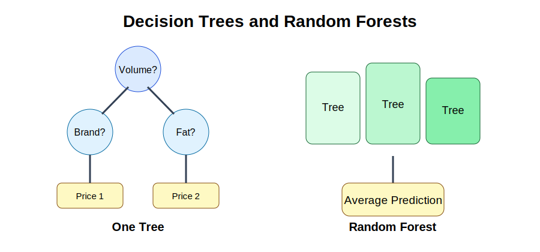



```{python}
#| echo: false
import pandas as pd
from sklearn.model_selection import train_test_split

milk_data = pd.read_csv("Milk_Data_S2025n.csv")

feature_columns = [
    "Volume",
    "Size",
    "Pieces",
    "Location",
    "Type",
    "Brand",
    "Fat",
    "Fresh",
    "Package",
    "Flavor",
]

X = pd.get_dummies(milk_data[feature_columns], drop_first=True)
y = milk_data["Price"]

X_train, X_test, y_train, y_test = train_test_split(
    X,
    y,
    test_size=0.20,
    random_state=4107
)
```

## Purpose

Linear regression assumes a specific mathematical relationship between variables. In many real data situations, relationships are nonlinear and difficult to represent with a simple equation.

Decision Trees and Random Forests provide an alternative. Instead of estimating coefficients, they learn prediction rules from the data.

## Applied question

Can we predict milk prices more accurately when relationships between product characteristics and prices are nonlinear?

## Key idea

Decision Trees divide data into smaller groups using a sequence of rules. Random Forests combine many decision trees and average their predictions. This often improves prediction accuracy and reduces overfitting.

{fig-alt="Decision tree and random forest diagram." width="90%"}

## Minimal diagram

```text
Volume > 1000 ml?

├── Yes
│   ├── Brand = Premium?
│   │   ├── Yes → Predicted Price = 2.50
│   │   └── No  → Predicted Price = 1.90
│
└── No
    ├── Fat = Full?
    │   ├── Yes → Predicted Price = 1.30
    │   └── No  → Predicted Price = 1.10
```

A tree learns a sequence of decisions rather than estimating a coefficient.

## 24.1 What is a Decision Tree?

A Decision Tree is a prediction model based on repeated splitting of the data. The algorithm searches for questions that best separate observations into groups with similar outcomes.

Examples of splitting questions include:

- Is volume greater than 1000 ml?
- Is the brand premium?
- Is the product fresh milk?

Each split creates more homogeneous groups. The final prediction is based on observations within each terminal group, called a leaf.

## 24.2 How a tree learns

For regression problems, the algorithm searches for splits that reduce prediction error. The tree repeatedly asks:

> Which variable and cutoff value produce the largest improvement in prediction?

A split at 750 ml, for example, may separate low-price products from high-price products. The process continues until stopping criteria are reached.

Unlike regression, the model does not require linear relationships, log transformations, or manually specified interactions.

## 24.3 Advantages and limitations

### Advantages

- Easy to visualize.
- Captures nonlinear relationships.
- Handles interactions automatically.
- Requires fewer statistical assumptions.

### Limitations

- Sensitive to small changes in data.
- Large trees can overfit.
- Predictions may be unstable across samples.

Although trees are intuitive, a single tree can be fragile. This motivates Random Forests.

## 24.4 Overfitting in trees

A very large tree may fit the training data almost perfectly. This can be misleading. The tree may learn random noise rather than general patterns.

A model should capture reusable structure, not memorize individual observations.

## 24.5 Random Forests

A Random Forest builds many trees. Each tree uses a random sample of observations and a random subset of variables. The final prediction is the average prediction across all trees.

```text
Tree 1 → 1.80 OMR
Tree 2 → 1.95 OMR
Tree 3 → 1.75 OMR
Tree 4 → 1.90 OMR

Final prediction = 1.85 OMR
```

Combining many trees reduces the influence of unusual observations and random noise.

## 24.6 Estimating a Decision Tree

```{python}
from sklearn.tree import DecisionTreeRegressor

tree_model = DecisionTreeRegressor(
    max_depth=4,
    random_state=4107
)

tree_model.fit(X_train, y_train)
tree_predictions = tree_model.predict(X_test)
```

## Interpretation

The model learns a sequence of splitting rules from the training data. Predictions are generated using the final tree structure.

## 24.7 Estimating a Random Forest

```{python}
from sklearn.ensemble import RandomForestRegressor

forest_model = RandomForestRegressor(
    n_estimators=200,
    random_state=4107
)

forest_model.fit(X_train, y_train)
forest_predictions = forest_model.predict(X_test)
```

## Interpretation

The model combines information from many trees. This usually improves predictive accuracy and reduces overfitting.

## 24.8 Comparing models

```{python}
from sklearn.metrics import mean_squared_error

tree_rmse = mean_squared_error(y_test, tree_predictions) ** 0.5
forest_rmse = mean_squared_error(y_test, forest_predictions) ** 0.5

print("Tree RMSE:", round(tree_rmse, 3))
print("Forest RMSE:", round(forest_rmse, 3))
```

Example comparison:

| Model | RMSE |
|---|---:|
| Linear Regression | 0.31 |
| Decision Tree | 0.28 |
| Random Forest | 0.21 |

Lower prediction error indicates stronger predictive performance. However, lower RMSE does not automatically imply better economic understanding.

## 24.9 Variable importance

Random Forests can estimate which predictors contribute most to prediction.

| Variable | Importance |
|---|---:|
| Volume | 0.52 |
| Brand | 0.25 |
| Fat | 0.14 |
| Package | 0.09 |

Higher values indicate greater predictive contribution. They do not measure causality.

::: {.callout-warning title="Common mistake"}
Do not treat Random Forest variable importance as evidence of causal effects. It identifies predictors that help forecast outcomes, not variables that necessarily cause outcomes.
:::

## Key takeaway

- Decision Trees create predictions using a sequence of rules.
- Trees naturally capture nonlinear relationships.
- Large trees may overfit the training data.
- Random Forests combine many trees to improve prediction accuracy.
- Variable importance measures predictive contribution, not causality.

## Looking ahead

In the next chapter, we introduce XGBoost and compare its performance with regression, decision trees, and Random Forests.

<div class="chapter-nav">
  <div class="prev"><a href="chapter-23-regression-vs-machine-learning.html">← Previous: 23</a></div>
  <div class="next"><a href="chapter-25-xgboost-model-comparison.html">Next: 25 →</a></div>
</div>
