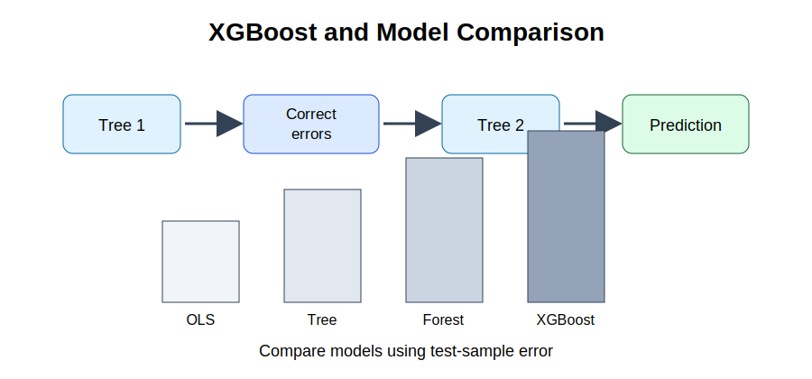



```{python}
#| echo: false
import pandas as pd
from sklearn.ensemble import RandomForestRegressor
from sklearn.linear_model import LinearRegression
from sklearn.model_selection import train_test_split
from sklearn.tree import DecisionTreeRegressor

milk_data = pd.read_csv("Milk_Data_S2025n.csv")

feature_columns = [
    "Volume",
    "Size",
    "Pieces",
    "Location",
    "Type",
    "Brand",
    "Fat",
    "Fresh",
    "Package",
    "Flavor",
]

X = pd.get_dummies(milk_data[feature_columns], drop_first=True)
y = milk_data["Price"]

X_train, X_test, y_train, y_test = train_test_split(
    X,
    y,
    test_size=0.20,
    random_state=4107
)

ols = LinearRegression()
ols.fit(X_train, y_train)
ols_predictions = ols.predict(X_test)

tree_model = DecisionTreeRegressor(
    max_depth=4,
    random_state=4107
)
tree_model.fit(X_train, y_train)
tree_predictions = tree_model.predict(X_test)

forest_model = RandomForestRegressor(
    n_estimators=200,
    random_state=4107
)
forest_model.fit(X_train, y_train)
forest_predictions = forest_model.predict(X_test)
```

## Purpose

Random Forests improve prediction by combining many independent trees. Boosting follows a different logic. It builds trees sequentially, allowing each new tree to learn from previous prediction errors.

One of the most widely used boosting algorithms is XGBoost, short for Extreme Gradient Boosting.

This chapter introduces XGBoost and shows how to compare predictive models using test-sample performance.

## Applied question

Which model predicts milk prices most accurately: linear regression, decision trees, Random Forests, or XGBoost?

## Key idea

Different models can produce different predictions from the same data. Rather than choosing a model because it is popular, we compare models using out-of-sample prediction performance.

{fig-alt="Boosting and model comparison diagram." width="90%"}

## Minimal concept

Random Forest:

```text
Many trees → independent learning → average predictions
```

XGBoost:

```text
Tree 1 → learn from mistakes → Tree 2 → learn from mistakes → Tree 3 → final prediction
```

## 25.1 Why boosting was developed

Decision Trees are simple but unstable. Random Forests improve stability by averaging many trees. However, Random Forests do not explicitly focus on correcting earlier mistakes.

Boosting takes a different approach. Each new tree is built to improve the errors made by earlier trees. Instead of working independently, the trees cooperate.

This sequential learning process often produces highly accurate predictions.

## 25.2 What is XGBoost?

XGBoost is an efficient implementation of gradient boosting. It is designed to improve prediction accuracy, reduce overfitting, handle large datasets efficiently, and capture nonlinear relationships.

A simplified learning process is:

1. Build a small tree.
2. Calculate prediction errors.
3. Build another tree focused on those errors.
4. Repeat many times.
5. Combine all trees into a final prediction.

Unlike regression models, XGBoost does not produce easily interpretable coefficients. Its primary objective is prediction.

## 25.3 Training an XGBoost model

```{python}
try:
    from xgboost import XGBRegressor
except Exception:
    from sklearn.ensemble import GradientBoostingRegressor as XGBRegressor

xgb_model = XGBRegressor(
    n_estimators=200,
    learning_rate=0.05,
    max_depth=4,
    random_state=4107
)

xgb_model.fit(X_train, y_train)
xgb_predictions = xgb_model.predict(X_test)
```

## Interpretation

The model creates many small trees. Each tree attempts to improve on previous predictions. The final prediction combines information from all trees.

## 25.4 Measuring prediction performance

The most common performance measures are RMSE, MAE, and test-sample \(R^2\).

\[
RMSE = \sqrt{\frac{1}{n}\sum(Actual_i - Predicted_i)^2}
\]

\[
MAE = \frac{1}{n}\sum |Actual_i - Predicted_i|
\]

For predictive analysis, RMSE and MAE are often more informative than \(R^2\) because they directly measure prediction errors.

## 25.5 Comparing multiple models

Suppose we estimate four models:

1. Linear Regression
2. Decision Tree
3. Random Forest
4. XGBoost

Each model should be evaluated on the same test sample.

```{python}
from sklearn.metrics import mean_squared_error, mean_absolute_error, r2_score

models = {
    "OLS": ols_predictions,
    "Tree": tree_predictions,
    "Forest": forest_predictions,
    "XGBoost": xgb_predictions
}

results = []

for name, pred in models.items():
    rmse = mean_squared_error(y_test, pred) ** 0.5
    mae = mean_absolute_error(y_test, pred)
    r2 = r2_score(y_test, pred)
    results.append([name, rmse, mae, r2])

results_df = pd.DataFrame(
    results,
    columns=["Model", "RMSE", "MAE", "R2"]
)

print(results_df)
```

Example results:

| Model | RMSE | MAE | R² |
|---|---:|---:|---:|
| OLS | 0.31 | 0.23 | 0.71 |
| Decision Tree | 0.28 | 0.20 | 0.75 |
| Random Forest | 0.22 | 0.16 | 0.84 |
| XGBoost | 0.19 | 0.14 | 0.88 |

## Interpretation

In this example, XGBoost has the lowest RMSE and the highest \(R^2\). It provides the most accurate predictions. This does not necessarily mean it is the most useful model for economic explanation.

## 25.6 Visual comparison of models

```{python}
import matplotlib.pyplot as plt

plt.figure(figsize=(7, 5))
plt.bar(results_df["Model"], results_df["RMSE"])
plt.title("Prediction Error by Model")
plt.ylabel("RMSE")
plt.show()
```

The shortest bar represents the smallest prediction error.

## 25.7 Why simpler models still matter

It is tempting to always choose the model with the lowest error. But simpler models remain valuable.

If a policymaker asks how much package volume affects price, a regression model may be more appropriate because coefficients can be interpreted. If a supermarket asks what price to expect next week, prediction accuracy may be more important.

The best predictive model is not always the best explanatory model.

## 25.8 Beyond accuracy

Prediction accuracy is important, but it is not the only consideration. Researchers should also consider interpretability, computational cost, transparency, reproducibility, and economic relevance.

A small improvement in RMSE may not justify a substantial increase in complexity.

::: {.callout-warning title="Common mistake"}
Do not declare the model with the highest \(R^2\) as the best model without considering RMSE, MAE, interpretability, and the purpose of the analysis.
:::

## Key takeaway

- XGBoost builds trees sequentially.
- Each new tree learns from previous prediction errors.
- XGBoost often produces accurate predictions.
- RMSE and MAE are useful measures of predictive performance.
- Model comparison should use test-sample results.
- Better prediction does not imply better economic explanation.

## Looking ahead

In the next chapter, we examine feature importance and discuss what machine learning models can and cannot tell us about economic relationships.

<div class="chapter-nav">
  <div class="prev"><a href="chapter-24-decision-trees-random-forests.html">← Previous: 24</a></div>
  <div class="next"><a href="chapter-26-feature-importance.html">Next: 26 →</a></div>
</div>
