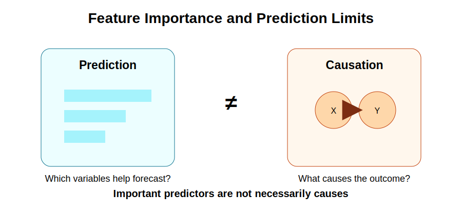



```{python}
#| echo: false
import pandas as pd
from sklearn.ensemble import RandomForestRegressor
from sklearn.model_selection import train_test_split

milk_data = pd.read_csv("Milk_Data_S2025n.csv")

feature_columns = [
    "Volume",
    "Size",
    "Pieces",
    "Location",
    "Type",
    "Brand",
    "Fat",
    "Fresh",
    "Package",
    "Flavor",
]

X = pd.get_dummies(milk_data[feature_columns], drop_first=True)
y = milk_data["Price"]

X_train, X_test, y_train, y_test = train_test_split(
    X,
    y,
    test_size=0.20,
    random_state=4107
)

forest_model = RandomForestRegressor(
    n_estimators=200,
    random_state=4107
)
forest_model.fit(X_train, y_train)
```

# 26. Feature Importance

## Purpose

Machine learning models can often predict outcomes accurately, but prediction alone does not tell us why those outcomes occur.

In economics, researchers usually want more than prediction. They want to understand which variables matter, how they matter, and whether relationships reflect genuine economic mechanisms.

This chapter examines feature importance and explains why prediction should not be confused with causation.

## Applied question

Which product characteristics contribute most to predicting milk prices?

## Key idea

Machine learning models can identify variables that improve prediction. However, variables that are important for prediction are not necessarily causes of the outcome.

{fig-alt="Diagram showing that prediction importance is not the same as economic or causal importance." width="85%"}

## Minimal concept

```text
Prediction importance ≠ Economic importance ≠ Causal importance
```

A variable can be useful for prediction without causing the outcome.

## 26.1 What is feature importance?

Feature importance measures the contribution of a variable to predictive performance. When a model uses several predictors, some variables may help prediction more than others.

For example, a Random Forest predicting milk prices may use volume, brand, fat content, package type, and freshness. Feature importance attempts to quantify how much each variable helps improve prediction.

| Variable | Importance |
|---|---:|
| Volume | 0.48 |
| Brand | 0.27 |
| Fat | 0.15 |
| Package | 0.07 |
| Freshness | 0.03 |

Higher importance values indicate that a variable contributes more to prediction. They do not indicate economic significance or causality.

## 26.2 Feature importance in Random Forests

Random Forests naturally generate importance measures. The algorithm evaluates how much each variable improves prediction across many trees.

```{python}
import pandas as pd

importance = pd.DataFrame({
    "Variable": X_train.columns,
    "Importance": forest_model.feature_importances_
})

importance = importance.sort_values(
    "Importance",
    ascending=False
)

print(importance)
```

## Visualization

```{python}
import matplotlib.pyplot as plt

importance.sort_values("Importance").plot(
    x="Variable",
    y="Importance",
    kind="barh",
    legend=False
)

plt.title("Feature Importance")
plt.show()
```

## Interpretation

The graph ranks predictors according to their contribution to model performance. Researchers can use this ranking as a starting point for further investigation.

## 26.3 Permutation importance

Standard importance measures can sometimes be misleading. Permutation importance provides an alternative.

For each variable:

1. Randomly shuffle its values.
2. Recalculate prediction accuracy.
3. Measure how much accuracy declines.

If prediction accuracy deteriorates sharply, the variable was important.

```{python}
from sklearn.inspection import permutation_importance

perm = permutation_importance(
    forest_model,
    X_test,
    y_test,
    n_repeats=10,
    random_state=4107
)

perm_importance = pd.DataFrame({
    "Variable": X_test.columns,
    "Importance": perm.importances_mean
}).sort_values("Importance", ascending=False)

print(perm_importance)
```

## Interpretation

Permutation importance asks what happens when the model loses useful information from one variable. If accuracy falls sharply, the variable was important for prediction.

## 26.4 Partial dependence plots

Feature importance tells us which variables matter for prediction. Partial dependence plots help us understand how predictions change as a variable changes.

For example:

- How does predicted price change as volume increases?
- How does predicted price change across package types?

```{python}
from sklearn.inspection import PartialDependenceDisplay

PartialDependenceDisplay.from_estimator(
    forest_model,
    X_train,
    ["Volume"]
)
```

## Interpretation

Partial dependence plots improve transparency. They help researchers understand how a machine learning model behaves. However, they still do not establish causal relationships.

## 26.5 Why prediction is not causation

Suppose a model finds that premium brands are important predictors of price. Can we conclude that becoming a premium brand causes higher prices?

Not necessarily.

Premium brands may differ in quality, marketing, consumer preferences, distribution, and product positioning. The model shows predictive value, not a clean causal effect.

A classic example is ice cream sales and drowning incidents. Both may increase during hot weather. Ice cream sales may help predict drowning incidents, but ice cream sales do not cause drowning.

## 26.6 What machine learning can do

Machine learning is useful when the objective is prediction. Examples include forecasting food prices, predicting crop yields, demand forecasting, credit scoring, and consumer behavior prediction.

Its strengths include handling large datasets, capturing nonlinear relationships, detecting complex interactions, and often improving prediction.

## 26.7 What machine learning cannot automatically do

Machine learning does not automatically solve fundamental econometric problems, such as omitted variable bias, endogeneity, reverse causality, measurement error, and selection bias.

A model may predict agricultural exports accurately, but this does not mean it identifies the causal effect of trade agreements on exports. Causal analysis requires research design, theory, and appropriate econometric methods.

## 26.8 Responsible use in economics

Machine learning should be viewed as a complement to econometrics, not a replacement.

A practical workflow is:

1. Use economic theory to formulate the question.
2. Use regression models to estimate interpretable relationships.
3. Use machine learning models to improve prediction.
4. Compare results and evaluate robustness.

This combines the strengths of both traditions.

## Bringing Part V together

| Chapter | Main theme |
|---:|---|
| 22 | Train-test split and prediction |
| 23 | Regression versus machine learning |
| 24 | Decision Trees and Random Forests |
| 25 | XGBoost and model comparison |
| 26 | Feature importance and prediction limits |

Together, these chapters introduce predictive analytics while maintaining the econometric focus of the course.

::: {.callout-warning title="Common mistake"}
Do not interpret feature importance as evidence of causality. Feature importance identifies variables that improve prediction. Causal inference requires theory, research design, and econometric methods.
:::

## Key takeaway

- Feature importance measures predictive contribution.
- Important predictors are not necessarily important causes.
- Permutation importance provides an alternative importance measure.
- Partial dependence plots help explain model behavior.
- Machine learning identifies patterns, not causal mechanisms.
- Econometrics and machine learning are complementary tools.
- Economic theory remains essential for empirical analysis.

## Looking ahead

The next part of the course moves from prediction to research practice. Students will learn how to formulate research questions, organize data, write methodology sections, present empirical results, and prepare a complete empirical article.

<div class="chapter-nav">
  <div class="prev"><a href="chapter-25-xgboost-model-comparison.html">← Previous: 25</a></div>
  <div class="next"><a href="chapter-27-choosing-a-research-question.html">Next: 27 →</a></div>
</div>
