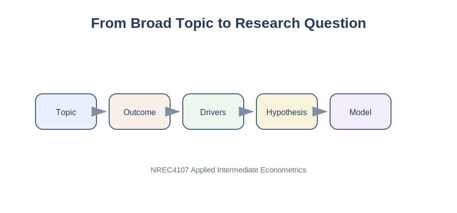

# Purpose

Every empirical project begins with a question. A good research question gives direction to the data section, the methodology, the regression model, and the interpretation of results. In applied econometrics, the objective is not to answer every possible question. The objective is to answer one important question clearly using data.

::: {.callout-tip}
For the full empirical project checklist, see [Appendix D. Project Checklist](../appendices/appendix-d-project-checklist.qmd).
:::

This chapter explains how to transform a broad topic into a focused empirical research question suitable for a semester project.

{fig-alt="Research question funnel from broad topic to model."}

# Applied Question

> How can I turn an economic issue into a researchable empirical question?

# Key Idea

Many empirical projects fail before the first regression is estimated because the research question is too broad.

| Broad Topic | Better Research Question |
|---|---|
| Food security | How are international cereal prices transmitted to food prices in Oman? |
| Trade | Are larger economies associated with higher bilateral trade flows? |
| Agriculture | Do larger milk packages have lower unit prices? |
| Finance | Are stock returns associated with inflation changes? |

A strong research question is specific, measurable, data driven, economically meaningful, and feasible within one semester.

::: {.callout-tip}
## Key Principle

A successful econometrics project answers one question well rather than many questions poorly.
:::

# From Topic to Question

## Step 1: Choose an Area of Interest

Start with an area that has economic meaning.

Examples include food prices, agricultural production, water use, trade policy, inflation, stock markets, food security, and consumer behavior.

## Step 2: Identify the Outcome Variable

Ask:

> What outcome am I trying to explain?

| Topic | Possible Outcome Variable |
|---|---|
| Milk markets | Price or unit price |
| Trade | Exports or imports |
| Agriculture | Yield or production |
| Finance | Stock returns |
| Food security | Food inflation |

The outcome variable will usually become the dependent variable.

## Step 3: Identify Explanatory Variables

Ask:

> What factors may influence the outcome?

| Outcome | Possible Explanatory Variables |
|---|---|
| Milk price | Volume, brand, fat content, package type |
| Exports | GDP, distance, exchange rate, trade agreements |
| Crop yield | Rainfall, fertilizer use, land area |
| Stock returns | Inflation, interest rates, oil prices |

# Turning Questions into Hypotheses

A hypothesis is a prediction based on economic reasoning.

Research question:

> Do larger milk packages have lower prices per liter?

Hypothesis:

> Larger packages are associated with lower unit prices because packaging and distribution costs may be spread over a larger volume.

Research question:

> Does inflation reduce household purchasing power?

Hypothesis:

> Higher inflation is associated with lower real consumption expenditure.

::: {.callout-note}
## Remember

A hypothesis should be based on economic reasoning, not personal opinion.
:::

# Python Example: Exploring a Candidate Question

Before estimating a model, visualize the possible relationship.

```python
import pandas as pd
import matplotlib.pyplot as plt

milk_data = pd.read_csv("../data/Milk_Data_S2025n.csv")
milk_data["Volume"] = milk_data["Size"] * milk_data["Pieces"]

plt.scatter(milk_data["Volume"], milk_data["Price"], alpha=0.6)
plt.xlabel("Volume")
plt.ylabel("Price")
plt.title("Milk Price and Package Volume")
plt.show()
```

# Interpretation

The graph may suggest that larger packages tend to have higher total prices. However, a graph alone cannot show whether volume truly explains price differences. Brand, fat content, freshness, package type, and location may also matter.

::: {.callout-warning}
## Common Mistake

Seeing a pattern in a graph and immediately claiming causality. A visual relationship does not prove that one variable causes another.
:::

# Feasibility Checklist

Before finalizing a question, ask:

- Do I have data?
- Can I explain the economic logic?
- Can I estimate a simple model?
- Can I interpret the coefficient?
- Can I finish the project this semester?

If the answer to any question is no, simplify the project.

# Summary

A good econometrics project begins with a good question. The best questions are specific, measurable, economically meaningful, supported by data, and feasible.

::: {.callout-important}
## Key Takeaways

- Start with an economic problem, not a statistical method.
- A strong research question is focused and measurable.
- Every research question should lead naturally to a hypothesis.
- Data availability should influence project design.
- Good projects answer one question clearly.
:::

---

## Navigation

| Previous | Part VI | Next |
|---|---|---|
| [26. Feature Importance](../part-v/chapter-26-feature-importance.qmd) | [Part VI: Student Empirical Project](part-vi-student-empirical-project.qmd) | [28. Data Section](chapter-28-writing-the-data-section.qmd) |
