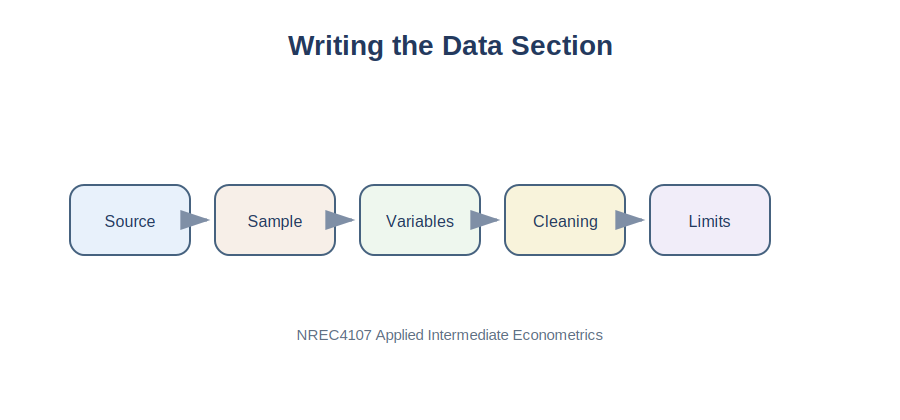

# Purpose

The data section tells the reader what data were used, where the data came from, how the variables were defined, and whether the sample has limitations. A good data section gives enough information for another researcher to understand and evaluate the analysis.

::: {.callout-tip}
For dataset integrity requirements, see [Appendix E. Dataset Integrity](../appendices/appendix-e-dataset-integrity.qmd).
:::

{fig-alt="Flow for writing a data section: source, sample, variables, cleaning, limitations."}

# Applied Question

> How do I write a clear and professional data section for an empirical project?

# Key Idea

The data section should answer four basic questions:

1. Where did the data come from?
2. What is the unit of observation?
3. What variables are used?
4. What are the main limitations of the data?

::: {.callout-tip}
## Key Principle

A strong data section is factual, transparent, and precise. It should not exaggerate what the data can show.
:::

# What Belongs in a Data Section?

A standard data section usually includes the data source, sample period, unit of observation, number of observations, variable definitions, descriptive statistics, cleaning decisions, and limitations.

# Data Source

Start by identifying the source clearly.

Good examples:

- The dataset was collected from supermarket milk product prices in Oman.
- Trade data were obtained from UN Comtrade.
- Macroeconomic indicators were downloaded from the World Bank.
- Food price data were obtained from FAOSTAT.

Avoid vague wording such as:

> Data were taken from the internet.

# Unit of Observation

The unit of observation tells the reader what each row represents.

| Dataset Type | Unit of Observation |
|---|---|
| Milk product data | One milk product |
| Country trade data | One country pair in one year |
| Time-series data | One month |
| Household survey | One household |
| Farm survey | One farm |

# Example: Milk Product Dataset

In the milk product dataset, each row represents one observed milk product.

| Variable | Description |
|---|---|
| Price | Product price |
| Size | Package size |
| Pieces | Number of pieces in the package |
| Volume | Size multiplied by pieces |
| Brand | Product brand |
| Fat | Fat category |
| Fresh | Freshness category |
| Package | Package type |
| Flavor | Flavor category |
| Location | Store or market location |

The constructed variable is:

\[
Volume_i = Size_i 	imes Pieces_i
\]

# Python Example: Inspecting Data

```python
import pandas as pd

milk_data = pd.read_csv("../data/Milk_Data_S2025n.csv")
milk_data.head()
```

```python
milk_data.info()
```

```python
milk_data.describe(include="all")
```

# Checking Missing Values

```python
milk_data.isnull().sum()
```

Example wording:

> The dataset was checked for missing observations. Observations with missing values in key regression variables were excluded from the final estimation sample.

::: {.callout-warning}
## Common Mistake

Do not hide missing values. A short honest explanation is better than pretending the dataset is perfect.
:::

# Creating Constructed Variables

```python
milk_data["Volume"] = milk_data["Size"] * milk_data["Pieces"]
milk_data["Unit_Price"] = milk_data["Price"] / milk_data["Volume"]
```

Example wording:

> Total volume was constructed by multiplying package size by the number of pieces. Unit price was calculated as price divided by total volume.

# Descriptive Statistics Table

```python
summary_table = milk_data[["Price", "Size", "Pieces", "Volume"]].agg(
    ["count", "mean", "std", "min", "max"]
).T

summary_table.round(3)
```

Do not only paste the table. Explain what it shows.

# Data Limitations

Every dataset has limitations. Possible limitations include small sample size, limited time period, missing characteristics, measurement error, non-random sampling, and lack of causal identification.

Example:

> The dataset is useful for studying price differences across observed milk products, but it does not contain information on promotions, wholesale costs, or consumer demand. Therefore, the results should be interpreted as associations rather than causal effects.

::: {.callout-note}
## Important

Limitations do not destroy a project. They clarify what the project can and cannot claim.
:::

# Sample Data Section

> This study uses a cross-sectional dataset of milk products observed in retail markets. Each observation represents one milk product. The main outcome variable is product price. The key explanatory variable is total package volume, constructed as package size multiplied by the number of pieces. Additional product characteristics include brand, fat content, package type, flavor, freshness, and location.
>
> The dataset was checked for missing values and inconsistent entries before analysis. Total volume and unit price were constructed from the original variables. Observations with missing values in key regression variables were excluded from the estimation sample. The dataset allows an applied analysis of price variation across milk products, but the results should be interpreted as conditional associations rather than causal effects.

# Checklist

- What is the data source?
- What is the sample period?
- What is the unit of observation?
- How many observations are used?
- What is the dependent variable?
- What are the explanatory variables?
- Were any variables constructed?
- Were missing values handled?
- What are the main limitations?

# Summary

The data section gives credibility to the empirical project. It should be accurate, transparent, and directly connected to the regression model.

::: {.callout-important}
## Key Takeaways

- The data section explains the source, structure, and variables.
- The unit of observation must be clearly stated.
- Constructed variables should be defined carefully.
- Descriptive statistics should be reported and briefly interpreted.
- Data limitations should be acknowledged honestly.
:::

---

## Navigation

| Previous | Part VI | Next |
|---|---|---|
| [27. Research Question](chapter-27-choosing-a-research-question.qmd) | [Part VI: Student Empirical Project](part-vi-student-empirical-project.qmd) | [29. Methodology](chapter-29-writing-the-methodology-section.qmd) |
