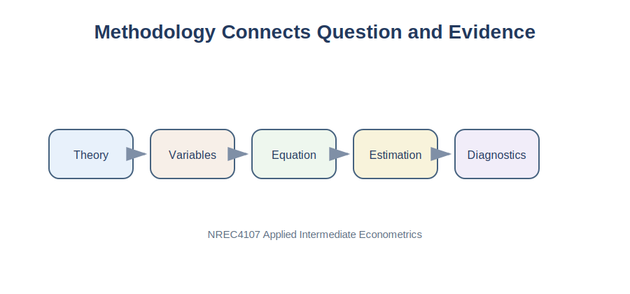

# Purpose

The methodology section explains how the research question will be answered. It connects economic reasoning, data, and statistical analysis.

{fig-alt="Bridge from theory to diagnostics in a methodology section."}

# Applied Question

> How do I explain my econometric model clearly and professionally?

# Key Idea

The methodology section should answer four questions:

1. What relationship is being studied?
2. Which variables are included?
3. Which econometric model is used?
4. Why is that model appropriate?

::: {.callout-tip}
## Key Principle

A good methodology section should be understandable to someone who has never seen your dataset before.
:::

# Start with Economic Logic

Example:

> Larger packages may have higher prices because they contain more product. However, larger packages may also have lower prices per unit because of economies of scale. Econometric analysis can help quantify the relationship between package volume and product price.

# Define Variables

| Variable | Description | Role |
|---|---|---|
| Price | Product price | Dependent variable |
| Volume | Total package volume | Main explanatory variable |
| Fat | Fat category | Control variable |
| Brand | Product brand | Control variable |
| Package | Package type | Control variable |

# Baseline Model

$$
Price_i = \beta_0 + \beta_1 Volume_i + u_i
$$

where \(Price_i\) is product price, \(Volume_i\) is package volume, \(\beta_0\) is the intercept, \(\beta_1\) measures the relationship between volume and price, and \(u_i\) is the error term.

# Multiple Regression Model

$$
Price_i = \beta_0 + \beta_1 Volume_i + \beta_2 Size_i + \beta_3 Pieces_i + u_i
$$

Multiple regression helps isolate relationships by holding other included variables constant.

::: {.callout-note}
## Important

The phrase "holding other variables constant" is one of the most important ideas in applied econometrics.
:::

# Functional Forms

## Linear Model

$$
Y_i = \beta_0 + \beta_1 X_i + u_i
$$

## Log-Linear Model

$$
\ln(Y_i) = \beta_0 + \beta_1 X_i + u_i
$$

A one-unit increase in \(X\) is associated with an approximate \(100\beta_1\)% change in \(Y\).

## Log-Log Model

$$
\ln(Y_i) = \beta_0 + \beta_1 \ln(X_i) + u_i
$$

The coefficient \(\beta_1\) is an elasticity.

# Estimation Method

Most NREC4107 projects will use Ordinary Least Squares.

Example wording:

> The model is estimated using Ordinary Least Squares, which identifies the coefficients that minimize the sum of squared residuals.

If relevant:

> Robust standard errors are reported to account for possible heteroskedasticity.

# Python Example

```python
import pandas as pd
import statsmodels.api as sm

milk_data = pd.read_csv("../data/Milk_Data_S2025n.csv")
milk_data["Volume"] = milk_data["Size"] * milk_data["Pieces"]

X = milk_data[["Volume", "Size", "Pieces"]]
y = milk_data["Price"]
X = sm.add_constant(X)

model = sm.OLS(y, X, missing="drop").fit()
print(model.summary())
```

# Diagnostic Checks

Briefly mention diagnostics when relevant.

Possible checks include residual plots, Breusch-Pagan test, Durbin-Watson statistic, Variance Inflation Factors, and Ramsey RESET test.

# Sample Methodology Paragraph

> This study examines the relationship between milk package volume and product price. The dependent variable is product price, while package volume serves as the main explanatory variable. Additional controls include package size and number of pieces. The relationship is estimated using Ordinary Least Squares. Regression coefficients are interpreted as conditional associations rather than causal effects. Diagnostic tests are conducted to assess the adequacy of the estimated model.

::: {.callout-warning}
## Common Mistakes

- Copying methodology sections from other papers.
- Including equations that are never discussed.
- Writing pages of assumptions without explaining the actual model.
- Describing results inside the methodology section.
- Confusing correlation with causation.
:::

# Summary

A strong methodology section connects theory, variables, and estimation in a clear way. Readers should understand exactly what model is estimated and why it was chosen.

::: {.callout-important}
## Key Takeaways

- Methodology links the research question to the empirical analysis.
- Begin with economic reasoning before equations.
- Define all variables clearly.
- Present only the models that are actually estimated.
- Explain how coefficients will be interpreted.
- Keep the methodology simple and reproducible.
:::

---

## Navigation

| Previous | Part VI | Next |
|---|---|---|
| [28. Data Section](chapter-28-writing-the-data-section.qmd) | [Part VI: Student Empirical Project](part-vi-student-empirical-project.qmd) | [30. Results and Discussion](chapter-30-writing-results-and-discussion.qmd) |
