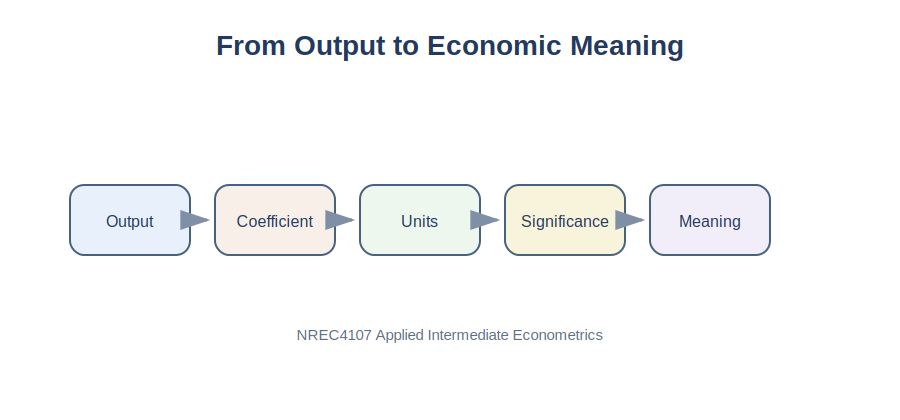

# Purpose

The results and discussion section is where empirical evidence becomes an economic argument. A good results section interprets coefficients, evaluates statistical and economic significance, and connects the findings to the research question.

::: {.callout-tip}
For exam-style interpretation practice, see [Appendix C. Exam Practice](../appendices/appendix-c-exam-practice.qmd).
:::

{fig-alt="Flow from regression output to economic meaning."}

# Applied Question

> How do I explain regression results in a way that is statistically correct and economically meaningful?

# Key Idea

Regression output is not the result. Interpretation is the result.

::: {.callout-tip}
## Key Principle

Every important coefficient should be interpreted in words, using the correct units.
:::

# What Belongs in the Results Section?

A standard results section includes a reminder of the model, the regression table, interpretation of key coefficients, statistical significance, economic significance, model fit, robustness or diagnostic comments, and a link back to the research question.

# Python Example

```python
import pandas as pd
import statsmodels.api as sm

milk_data = pd.read_csv("../data/Milk_Data_S2025n.csv")
milk_data["Volume"] = milk_data["Size"] * milk_data["Pieces"]

analysis_data = milk_data.dropna(subset=["Price", "Volume", "Size", "Pieces"])
X = analysis_data[["Volume", "Size", "Pieces"]]
y = analysis_data["Price"]
X = sm.add_constant(X)

model = sm.OLS(y, X).fit()
print(model.summary())
```

# Understanding a Regression Table

| Column | Meaning |
|---|---|
| Coefficient | Estimated relationship |
| Standard Error | Precision of the estimate |
| t-statistic | Coefficient divided by standard error |
| p-value | Evidence against the null hypothesis |
| R-squared | Share of variation explained by the model |
| Observations | Number of rows used in estimation |

# Interpreting Coefficients

Weak interpretation:

> Volume is significant.

Better interpretation:

> The estimated coefficient on volume is 0.002. This means that a one-unit increase in package volume is associated with a 0.002 OMR increase in price, holding size and pieces constant.

More useful interpretation:

> Equivalently, a 100-unit increase in package volume is associated with a 0.20 OMR increase in price, holding other included variables constant.

::: {.callout-note}
## Important

Always ask: one unit of what? A coefficient has no practical meaning unless the unit is clear.
:::

# Statistical and Economic Significance

Statistical significance tells us whether the estimated relationship is unlikely to be zero under the null hypothesis. Economic significance asks whether the estimated effect is large enough to matter.

| Situation | Interpretation |
|---|---|
| Significant and large | Strong empirical relevance |
| Significant but small | Precise but possibly minor effect |
| Insignificant but large | Potentially important but imprecise |
| Insignificant and small | Weak evidence of relevance |

::: {.callout-warning}
## Common Mistake

Do not write that a variable is important only because its p-value is below 0.05.
:::

# Interpreting Dummy Variables

If a dummy variable for imported products has a coefficient of 0.35:

> Imported milk products are estimated to be 0.35 OMR more expensive than local products, holding package volume constant.

For categorical variables with many groups, always mention the reference group.

# Interpreting Log Models

For a log-log model:

\[
\ln(Price_i) = eta_0 + eta_1 \ln(Volume_i) + u_i
\]

Interpretation:

> A 1 percent increase in volume is associated with an estimated \(eta_1\) percent increase in price.

# Robust Standard Errors

```python
robust_model = model.get_robustcov_results(cov_type="HC1")
print(robust_model.summary())
```

# Clean Regression Table

```python
results_table = pd.DataFrame({
    "Coefficient": model.params,
    "Std. Error": model.bse,
    "p-value": model.pvalues
})

results_table.round(4)
```

# Sample Results Paragraph

> Table 1 reports the OLS estimates for milk product prices. The coefficient on package volume is positive, suggesting that larger packages are associated with higher total prices. This finding is consistent with the expectation that products containing more milk are sold at higher prices. However, the coefficient should be interpreted in units of volume, and the result should not be treated as evidence of causality.

# Discussing Unexpected Results

Unexpected results are common. Do not hide them.

Example:

> The coefficient on package size is smaller than expected. One possible explanation is that larger packages may have lower unit prices because of economies of scale. Another possibility is that omitted product characteristics, such as promotions or brand positioning, influence the estimated relationship.

# Summary

The results and discussion section should convert statistical output into clear economic interpretation.

::: {.callout-important}
## Key Takeaways

- Regression output needs interpretation.
- Every important coefficient should be explained in words.
- Statistical significance and economic significance are different.
- \(R^2\) measures fit, not truth.
- Observational results should usually be interpreted as associations.
- A good discussion is cautious and connected to the research question.
:::

---

## Navigation

| Previous | Part VI | Next |
|---|---|---|
| [29. Methodology](chapter-29-writing-the-methodology-section.qmd) | [Part VI: Student Empirical Project](part-vi-student-empirical-project.qmd) | [31. Tables and Figures](chapter-31-preparing-tables-graphs-and-appendices.qmd) |
