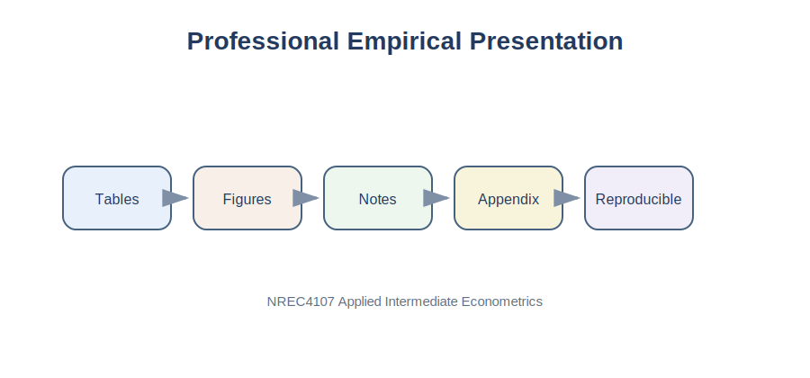

# Purpose

Good empirical research can be weakened by poor presentation. Readers often form their first impression of a paper by looking at its tables and figures before reading the text.

This chapter explains how to prepare professional tables, graphs, and appendices for an empirical article.

{fig-alt="Professional empirical presentation workflow."}

# Applied Question

> How can I present empirical results clearly and professionally?

# Key Idea

Tables and figures should help readers understand the evidence. Every table and figure should answer a question.

::: {.callout-tip}
## Key Principle

The best tables and graphs are simple, readable, and directly related to the research question.
:::

# General Rules

Before creating any table or figure, ask:

1. What is the main message?
2. Can readers understand it quickly?
3. Does it add information beyond the text?
4. Is it necessary?

# Descriptive Statistics Table

```python
import pandas as pd

milk_data = pd.read_csv("../data/Milk_Data_S2025n.csv")
milk_data["Volume"] = milk_data["Size"] * milk_data["Pieces"]

summary_table = milk_data[["Price", "Size", "Pieces", "Volume"]].agg(
    ["count", "mean", "std", "min", "max"]
).T

summary_table.round(3)
```

# Regression Table

```python
import statsmodels.api as sm

X = milk_data[["Volume"]]
y = milk_data["Price"]
X = sm.add_constant(X)

model = sm.OLS(y, X, missing="drop").fit()

results = pd.DataFrame({
    "Coefficient": model.params,
    "Std. Error": model.bse,
    "p-value": model.pvalues
})

results.round(4)
```

Good regression tables use meaningful variable names, consistent decimals, standard errors, sample size, and \(R^2\). Avoid full software output.

::: {.callout-warning}
## Common Mistake

Never paste the entire regression output from Python into a paper.
:::

# Graphs for Descriptive Analysis

Graphs help readers understand patterns quickly. Common examples include histograms, scatter plots, box plots, time-series plots, and bar charts.

## Histogram

```python
import matplotlib.pyplot as plt

plt.hist(milk_data["Price"], bins=15)
plt.xlabel("Price")
plt.ylabel("Frequency")
plt.title("Distribution of Milk Prices")
plt.show()
```

## Scatter Plot

```python
plt.scatter(milk_data["Volume"], milk_data["Price"], alpha=0.6)
plt.xlabel("Volume")
plt.ylabel("Price")
plt.title("Price and Package Volume")
plt.show()
```

# Saving Publication-Quality Figures

```python
plt.savefig("figure1_price_volume.svg", bbox_inches="tight")
```

Recommended formats:

- SVG for clean website figures
- PNG for raster images
- PDF for formal submission

# Building a Results Figure

```python
milk_data = milk_data.dropna(subset=["Price", "Volume"])
X = sm.add_constant(milk_data[["Volume"]])
model = sm.OLS(milk_data["Price"], X).fit()
milk_data["Predicted"] = model.predict(X)

plt.scatter(milk_data["Volume"], milk_data["Price"], alpha=0.5)
plt.plot(milk_data["Volume"], milk_data["Predicted"])
plt.xlabel("Volume")
plt.ylabel("Price")
plt.title("Observed and Fitted Milk Prices")
plt.show()
```

# What Is an Appendix?

The appendix contains supporting material that is useful but not essential for the main text. Readers should be able to understand the paper without reading the appendix.

Appropriate appendix material includes additional regressions, robustness checks, variable definitions, diagnostic tests, survey instruments, data collection details, and additional figures.

# Reproducibility

Recommended project structure:

```text
project/
│
├── data/
│   ├── raw_data.csv
│   └── cleaned_data.csv
│
├── code/
│   └── analysis.py
│
├── tables/
├── figures/
└── paper/
```

# Sample Figure Discussion

> Figure 2 presents the relationship between package volume and milk prices. A positive association is visible, with larger packages generally exhibiting higher prices. However, substantial variation remains, suggesting that factors beyond package volume also influence price differences.

# Summary

Tables, figures, and appendices are tools for communication. Their purpose is to help readers understand evidence quickly and accurately.

::: {.callout-important}
## Key Takeaways

- Every table and figure should have a clear purpose.
- Use descriptive statistics and regression tables consistently.
- Label all figures and axes clearly.
- Avoid copying raw software output.
- Save publication-quality figures.
- Use appendices for supporting material.
- Organize files so the analysis can be reproduced.
:::

---

## Navigation

| Previous | Part VI | Next |
|---|---|---|
| [30. Results and Discussion](chapter-30-writing-results-and-discussion.qmd) | [Part VI: Student Empirical Project](part-vi-student-empirical-project.qmd) | [32. Article Template](chapter-32-final-empirical-article-template.qmd) |
