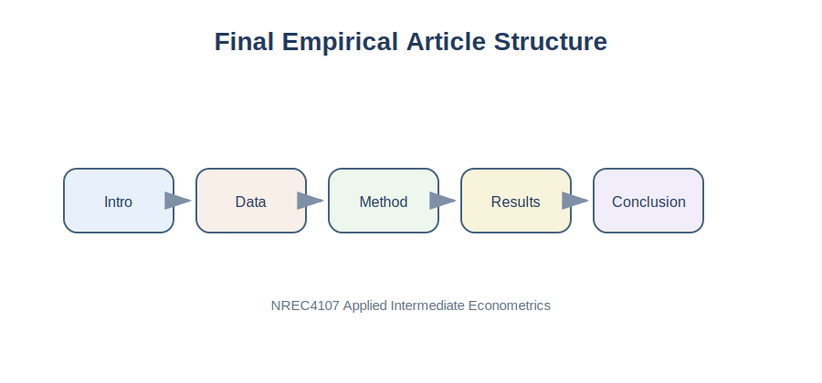

# Purpose

This final chapter provides a complete template for the student empirical article. By this stage, students should have a research question, a dataset, a methodology, results, tables, graphs, and appendices.

::: {.callout-tip}
For final project submission checks, see [Appendix C. Project Checklist](../appendices/appendix-c-project-checklist.qmd).
:::

{fig-alt="Structure of a final empirical article."}

# Applied Question

> What should my final empirical article look like?

# Key Idea

An empirical article tells an evidence-based story. It explains what question was asked, why the question matters, what data were used, what method was applied, what the results show, what the limitations are, and what conclusion follows from the evidence.

::: {.callout-tip}
## Key Principle

A good empirical paper is organized around one clear research question.
:::

# Recommended Article Structure

A student empirical article should include:

1. Title
2. Abstract
3. Introduction
4. Literature Review
5. Data
6. Methodology
7. Results and Discussion
8. Conclusion
9. References
10. Appendix

# Title

Weak title:

```text
Milk Prices
```

Better title:

```text
Package Volume and Milk Prices: Evidence from Retail Products in Oman
```

# Abstract Template

```text
This study examines [research question]. Using [data source/sample], the paper analyzes the relationship between [dependent variable] and [main explanatory variable]. The empirical analysis applies [method], controlling for [main controls]. The results show that [main finding]. The findings suggest that [economic interpretation]. However, the results should be interpreted as [association/causal evidence] because [main limitation]. The study contributes to understanding [broader issue].
```

# Introduction

The introduction should answer:

1. What is the issue?
2. Why does it matter?
3. What does this paper do?

::: {.callout-warning}
## Common Mistake

Do not begin the paper with definitions copied from textbooks. Begin with the economic problem.
:::

# Literature Review

For this course, the literature review should be short. Use 5 to 8 relevant sources. For each source, explain what it studied, what it found, and how it relates to your project.

Template:

```text
Previous studies have examined [topic] using [methods/data]. Some studies find that [finding], while others emphasize [alternative finding]. This study differs by focusing on [your sample, country, variable, or method].
```

# Data Section Template

```text
This study uses [type of data] obtained from [source]. The unit of observation is [unit]. The final sample includes [number] observations. The dependent variable is [variable]. The main explanatory variable is [variable]. Additional control variables include [variables].

The variable [constructed variable] is constructed as [formula]. The dataset was checked for missing values and inconsistent observations before estimation. The main limitation of the dataset is [limitation].
```

# Methodology Template

\[
Y_i = eta_0 + eta_1 X_i + u_i
\]

Applied example:

\[
Price_i = eta_0 + eta_1 Volume_i + u_i
\]

Extended model:

\[
Price_i = eta_0 + eta_1 Volume_i + eta_2 Brand_i + eta_3 Fat_i + eta_4 Package_i + u_i
\]

# Results and Discussion Template

```text
The coefficient on [variable] is [value]. This means that a one-unit increase in [variable] is associated with a [change] in [dependent variable], holding other included variables constant.
```

# Python Example: Creating Final Tables

```python
import pandas as pd
import statsmodels.api as sm

data = pd.read_csv("../data/Milk_Data_S2025n.csv")
data["Volume"] = data["Size"] * data["Pieces"]

analysis_data = data.dropna(subset=["Price", "Volume", "Size", "Pieces"])

X = analysis_data[["Volume", "Size", "Pieces"]]
y = analysis_data["Price"]
X = sm.add_constant(X)

model = sm.OLS(y, X).fit()

results_table = pd.DataFrame({
    "Coefficient": model.params,
    "Std. Error": model.bse,
    "p-value": model.pvalues
})

results_table.round(4)
```

# Conclusion Template

```text
This paper examined [research question] using [data]. The results show that [main finding]. This suggests that [economic interpretation]. However, the findings should be interpreted cautiously because [limitation]. Future research could extend the analysis by using [better data, longer period, additional variables, alternative methods].
```

::: {.callout-note}
## Important

The conclusion should not introduce new results.
:::

# Full Student Paper Template

```text
Title

Student Name
Course: NREC4107 Applied Intermediate Econometrics
Instructor: Prof. Osman Gulseven
Date

Abstract

[150 to 200 words summarizing the question, data, method, findings, and limitation.]

1. Introduction

[Motivation.]
[Research question.]
[Data and method.]
[Main finding.]
[Paper organization.]

2. Literature Review

[Briefly summarize relevant studies.]
[Explain how this paper is connected to previous work.]

3. Data

[Data source.]
[Unit of observation.]
[Sample size.]
[Variable definitions.]
[Descriptive statistics.]
[Data limitations.]

4. Methodology

[Economic reasoning.]
[Regression equation.]
[Variable definitions.]
[Estimation method.]
[Diagnostic approach.]

5. Results and Discussion

[Descriptive statistics.]
[Regression results.]
[Coefficient interpretation.]
[Statistical and economic significance.]
[Limitations.]

6. Conclusion

[Main question.]
[Main finding.]
[Implication.]
[Limitation.]
[Future research.]

References

[List all cited sources.]

Appendix

[Additional tables, graphs, diagnostics, or code.]
```

# Final Submission Checklist

- The title is specific.
- The abstract summarizes the full paper.
- The introduction explains the economic problem.
- The research question is clear.
- The data source is identified.
- The unit of observation is stated.
- Variables are defined.
- The regression model is written correctly.
- Coefficients are interpreted in words.
- Statistical and economic significance are discussed.
- Tables and figures are readable.
- Limitations are acknowledged.
- References are complete.
- Appendix material supports the main text.
- The paper does not claim causality without proper identification.

# Summary

The final empirical article should be clear, focused, and evidence based. It should answer one research question using data and econometric reasoning.

::: {.callout-important}
## Key Takeaways

- The final paper should be organized around one research question.
- Each section has a clear role.
- The data, methodology, and results sections must be consistent with each other.
- Coefficients must be interpreted in words.
- Limitations should be acknowledged honestly.
- A good empirical article tells a clear evidence-based story.
:::

---

## Navigation

| Previous | Part VI | Course Home |
|---|---|---|
| [31. Tables and Figures](chapter-31-preparing-tables-graphs-and-appendices.qmd) | [Part VI: Student Empirical Project](part-vi-student-empirical-project.qmd) | [Course Home](../index.qmd) |
