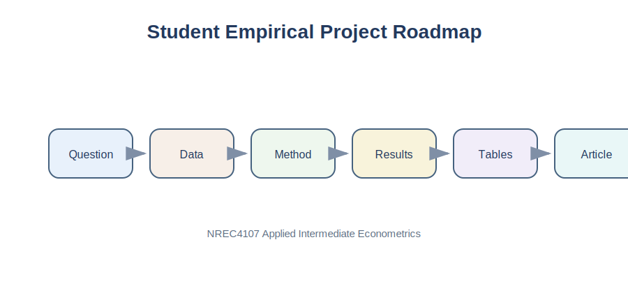

# Part VI Overview

Part VI helps students turn applied econometric work into a complete empirical article. The emphasis is practical: choose one clear question, describe the data, explain the method, interpret the results, prepare professional tables and figures, and assemble the final paper.

{fig-alt="Roadmap from research question to final empirical article."}

::: {.callout-tip}
## Teaching Focus

The goal is not to produce a long thesis. The goal is to produce a short, clear, evidence-based empirical article.
:::

# In This Part

| Chapter | Focus |
|---|---|
| [27. Research Question](chapter-27-choosing-a-research-question.qmd) | Choosing a focused research question |
| [28. Data Section](chapter-28-writing-the-data-section.qmd) | Writing the data section |
| [29. Methodology](chapter-29-writing-the-methodology-section.qmd) | Writing the methodology section |
| [30. Results and Discussion](chapter-30-writing-results-and-discussion.qmd) | Interpreting results and discussion |
| [31. Tables and Figures](chapter-31-preparing-tables-graphs-and-appendices.qmd) | Preparing tables, graphs, and appendices |
| [32. Article Template](chapter-32-final-empirical-article-template.qmd) | Final empirical article template |

# Expected Final Output

By the end of this part, students should be able to submit a compact empirical article with:

- A clear research question
- A transparent data section
- A simple econometric model
- Interpreted regression results
- Clean tables and figures
- A short conclusion and appendix

::: {.callout-warning}
## Common Mistake

Students often start writing before they know their research question. The question should guide the whole article.
:::

---

## Navigation

| Previous | Course Home | Next |
|---|---|---|
| [26. Feature Importance](../part-v/chapter-26-feature-importance.qmd) | [Course Home](../index.qmd) | [27. Research Question](chapter-27-choosing-a-research-question.qmd) |
